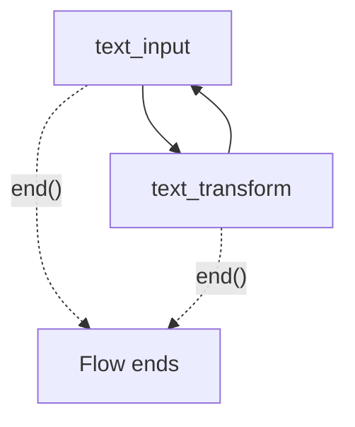

# Text Converter Flow

This project demonstrates an interactive text transformation tool built with Sley.

## Run

```bash
pip install -r requirements.txt
python main.py
```

## Features

- Convert text to UPPERCASE
- Convert text to lowercase
- Reverse text
- Remove extra spaces
- Interactive command-line interface
- Continuous flow with option to process multiple texts

## How It Works

The workflow features an interactive loop with branching paths:



The two ordinary returns follow the unlabelled links and keep the loop moving.
Calling `context.end()` creates a hard terminal instead, so the same links are
not followed. The nearby `return` only skips the remaining Python statements;
`end()` itself records the terminal.

Here's what each node does:

1. **`text_input`**: Collects text input and handles menu choices
2. **`text_transform`**: Applies the selected transformation to the text

## Example Output

```
Welcome to Text Converter!
=========================

Enter text to convert: Sley is a 100-line LLM framework

Choose transformation:
1. Convert to UPPERCASE
2. Convert to lowercase
3. Reverse text
4. Remove extra spaces
5. Exit

Your choice (1-5): 1

Result: SLEY IS A 100-LINE LLM FRAMEWORK

Convert another text? (y/n): n

Thank you for using Text Converter!
```

## Files

- [`main.py`](./main.py): Main entry point for running the text converter
- [`flow.py`](./flow.py): Defines the nodes and flow for text transformation
- [`requirements.txt`](./requirements.txt): Lists the required dependencies
