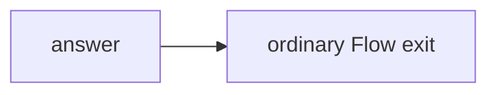

# Question Answer Flow

The `answer` node reads a question from `context.state`, asks the LLM, and stores
the answer back in state.



The handler emits nothing. Because it has no unlabelled link, its normal return
exits the Flow; a separate end node or `context.end()` call would add no value.

```python
state = {
    "question": "In one sentence, what's the end of universe?",
    "answer": None,
}
```
