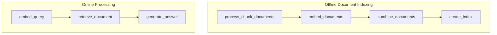

# Retrieval Augmented Generation (RAG)

This project demonstrates a simplified RAG system that retrieves relevant documents based on user queries and generates answers using an LLM. This implementation is based directly on this tutorial (for Pocketflow): [Retrieval Augmented Generation (RAG) from Scratch — Tutorial For Dummies](https://zacharyhuang.substack.com/p/retrieval-augmented-generation-rag).

## Run

Set `OPENAI_API_KEY`, then run:

```bash
pip install -r requirements.txt
python main.py
```

## Features

- Document chunking for processing long texts
- FAISS-powered vector-based document retrieval
- LLM-powered answer generation

## Fan-out and combine

The offline Flow fans out over the source texts and joins them directly in
`flow.py`:

- `dispatch_documents` emits one `document` branch per text.
- Each document branch finishes with `end(document)`, making that document
  available through `result.outputs`.
- `combine_documents` runs once after all branches settle and flattens their
  chunks and embeddings into shared state.

For an empty input list, the dispatcher calls `end()` so it creates zero document
branches. The combiner receives no outputs and emits nothing, preserving that hard
end instead of continuing to index creation.

## How It Works

The magic happens through a two-phase pipeline implemented with Caskada:



Here's what each part does:

1. **Process documents**: Breaks documents into smaller chunks for better retrieval
2. **Embed documents**: Converts document chunks into vector representations
3. **Combine documents**: Flattens the worker outputs into chunks and embeddings
4. **Create index**: Creates a searchable FAISS index from embeddings
5. **Embed query**: Converts the user query into the same vector space
6. **Retrieve document**: Finds the most similar document using vector search
7. **Generate answer**: Uses an LLM to generate an answer based on the retrieved content

## Example Output

```
✅ Created 1 document embeddings
✅ Created 1 document embeddings
✅ Created 1 document embeddings
✅ Created 1 document embeddings
✅ Created 1 document embeddings
🔍 Creating search index...
✅ Index created with 5 vectors
🔍 Embedding query: How to install Caskada?
🔎 Searching for relevant documents...
📄 Retrieved document (index: 0, distance: 0.3427)
📄 Most relevant text: "Caskada is a 300-line minimalist LLM framework
        Lightweight: Just 300 lines. Zero bloat, zero dependencies, zero vendor lock-in.
        Expressive: Everything you love—(Multi-)Agents, Workflow, RAG, and more.
        Agentic Coding: Let AI Agents (e.g., Cursor AI) build Agents—10x productivity boost!
        To install, pip install caskada or just copy the source code (only 300 lines)."

🤖 Generated Answer:
To install Caskada, use the command `pip install caskada` or simply copy its 300 lines of source code.
```
