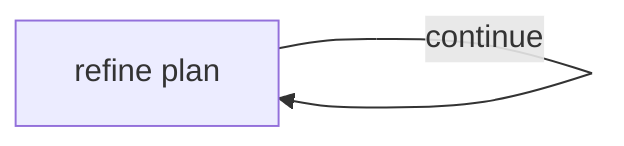

# Iterative Plan Refinement

One async node asks a model to update a compact plan, records only an observable
progress summary, and follows a `"continue"` self-link when another pass is
needed. A final answer exits normally.

The model response is validated before the iteration enters state. The
application allows at most four passes, while `max_activations=4` gives the
cycle an independent graph-level backstop. Provider failures retry the complete
handler, so a failed attempt cannot publish half an iteration.

This is an evaluator–optimizer-style planning loop, not a claim that exposing
chain-of-thought makes answers correct. For factual, mathematical, or coding
work, add retrieval, tests, execution, or another external quality signal.



## Run

```bash
export ANTHROPIC_API_KEY="your-api-key"
pip install -r requirements.txt
python main.py "your problem"
```

Set `ANTHROPIC_MODEL` to override the default provider model.
