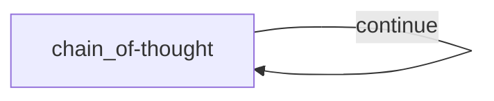

# Chain-of-Thought Node Design

## 1. Requirements

Create a self-looping chain-of-thought node that can:

- Solve a problem step by step with a structured plan.
- Evaluate the previous step before proceeding.
- Refine complex steps into nested sub-steps.
- Record the plan, thought trace, and final conclusion in state.
- Retry a failed model response.

## 2. Flow Design

The Flow contains one node that follows its `"continue"` edge while more
thinking is needed:



```python
thought = node(
    chain_of_thought,
    retry=RetryPolicy(max_attempts=3, delay_ms=10_000),
)
thought.link(thought, "continue")
flow = Flow(thought, max_activations=50)
```

The retry applies to the whole function. The function therefore parses the
model response before adding the new thought to state.

## 3. State

```python
initial_state = {
    "problem": str,
    "thoughts": list[dict],
    "current_thought_number": int,
    "solution": str | None,
}
```

Each thought contains the model's reasoning, updated plan, thought number, and
whether another thought is needed. Plan steps may contain nested `sub_steps`.

## 4. Node Design

The handler performs one complete thought step:

1. Read the problem and previous thoughts from `context.state`.
2. Format the previous plan and build the prompt.
3. Call the model and parse its YAML response.
4. Print and store the accepted thought.
5. Emit `"continue"` when another thought is needed.

When the conclusion is ready, the function emits nothing. That follows the
root Flow's ordinary unlabelled exit and completes the run. `end()` is not
needed because the example is neither forcing a hard stop nor returning a
branch output to a combiner.

## 5. Utilities

- `call_llm`: Generate the next thought and updated plan.
- `format_plan`: Display the complete plan.
- `format_plan_for_prompt`: Show a compact plan to the model.
