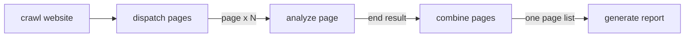

# Web Crawler with Content Analysis

A Sley flow that crawls a website, analyzes each page with an LLM, and
assembles one report.

## Run

Set `OPENAI_API_KEY`, then run:

```bash
pip install -r requirements.txt
python main.py
```

## Fan-out and Combine

The crawler emits its pages as input to a nested analysis Flow:

1. `dispatch_pages` emits one `page` branch for every crawled page.
2. Each `analyze_page` worker calls `end(value)` to publish its result.
3. `combine_pages` runs after every worker settles and collects those outputs.
4. The combiner emits one page list, so `generate_report` runs exactly once.



## Project Structure

```
python-tool-crawler/
├── tools/
│   ├── crawler.py     # Web crawling functionality
│   └── parser.py      # Content analysis using LLM
├── utils/
│   └── call_llm.py    # LLM API wrapper
├── nodes.py           # Crawl, dispatch, analysis, and report handlers
├── flow.py            # Graph topology and combine callback
├── main.py           # Main script
└── requirements.txt   # Dependencies
```

## Limitations

- Crawls at most 25 pages from the exact starting origin; redirects are rejected.
- Accepts only HTTP(S) URLs and rejects local or literal private addresses.
- Reads at most one million characters per page and extracts text only.
- Use it with public URLs you trust. Complete SSRF protection also requires
  DNS and network policy at the application boundary.
- Provider timeouts and rate-limit policy remain application concerns.

## Dependencies

- Sley: Flow-based processing
- Requests: HTTP requests
- Beautiful Soup: HTML parsing
- OpenAI: page analysis
