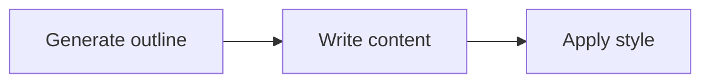

# Article Writing Workflow

A three-step workflow that asks an LLM to outline, draft, and polish an article.



Each node reads and writes the same run state. A successful handler that emits
nothing follows its unlabelled link, so the workflow needs no explicit control
calls. The final node has no link, so its normal completion exits the Flow.

`run()` returns the completed state. The caller must use that returned value
because Sley shallow-copies the initial top-level mapping.

## Run

```bash
export OPENAI_API_KEY="your-api-key"
pip install -r requirements.txt
python main.py "AI Safety"
```
