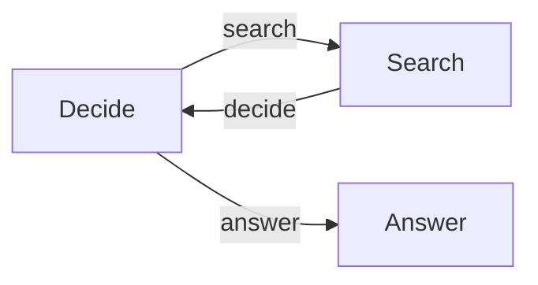

# Search Agent

An agent that decides whether it needs web research before answering a
question.



`context.emit(action)` selects a named link. The search node loops back to the
decision node, while the answer node emits nothing and therefore exits the Flow
normally.

Long-lived research and the final answer stay in `context.state`. This example
keeps its small static data model in `types.ts`, separate from the workflow.

## Decision Contract

The decision prompt shows the model the exact YAML shape for both allowed
actions. `parseDecision` still treats the response as untrusted data: it checks
the action, reason, and required search query before `context.emit(action)` can
change graph control. The TypeScript type documents the contract; the runtime
check enforces it.

This explicit prompt-and-validate approach is deliberately used instead of a
provider-specific structured-output helper, so the example works with both
OpenAI and OpenRouter without another schema library.

## Run

```bash
cp .env.example .env
npm install
npm run agent -- "What is the latest Deepseek LLM model?"
```
