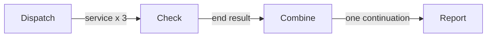

# Concurrent Service Checks

This example checks three services concurrently and reports one combined
summary.



The dispatcher calls `emit("check", service)` once per service. Each check reads
that service from `context.input` and calls `end(result)`, finishing only its
branch and publishing one output.

The Flow permits three checks to run at once. After all of them settle,
`combine` reads `result.outputs`, stores a summary in shared state, and emits one
unlabelled continuation so the report node runs exactly once.

## Run

```bash
npm install
npm start
```

The checks finish in latency order rather than declaration order. This makes
their concurrent execution visible without depending on an external service.
