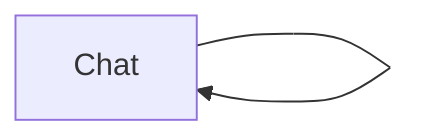

# Terminal Chat

A one-node terminal chat that remembers the conversation and repeats until the
user enters `exit`.



The node has an unlabelled link to itself. A normal successful return follows
that link and starts the next turn. `context.end()` bypasses the link and
finishes the branch, so the `exit` command closes the chat.

Conversation history stays in `context.state` and its small static model lives
in `types.ts`.

## Run

```bash
cp .env.example .env
npm install
npm run chat
```
