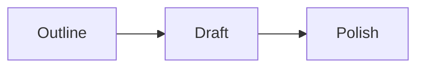

# A Small Typed Workflow

This example models an article pipeline as three explicit steps:



Every node reads and writes the same typed state. A successful handler with no
control call follows its unlabelled link, while the final node has no link and
therefore exits normally. The services are deterministic so the graph can be
run and changed without provider credentials.

## Run

```bash
npm install
npm start
```
