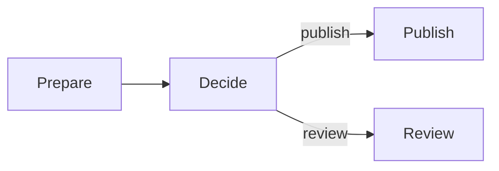

# Sley

Sley is a structured graph runtime for Python and TypeScript. It runs ordinary
functions as nodes, follows explicit links, and waits for every branch inside a
Flow to settle.

Sley is useful when the shape of the work matters: a process branches, loops,
fans out, joins, or needs a clear failure boundary. The graph makes those paths
visible while your application code remains ordinary code.

## When to use Sley

Use Sley when you need one or more of these:

- several allowed paths that should be visible before execution;
- fan-out work followed by one structured join;
- reusable nested workflows with their own exits or concurrency limit;
- the same small runtime contract in Python and TypeScript.

Prefer normal function calls, `if` statements, and loops when they already make
the process easy to follow. Sley is also not a persistence or distributed-job
system: it does not provide replay, durable pauses, transactional state,
timeouts, or cross-machine execution.

## The shape of a Sley program

- A **Node** wraps one function that does application work.
- A **link** names an allowed move to another Node or Flow.
- A **Context** gives the function shared state, branch input, and control calls.
- A **Flow** owns an entry point and waits for all work in its scope to settle.

The common case stays quiet: when a node returns normally without choosing a
route, Sley follows its unlabelled link. Explicit `emit()` calls choose paths or
create branches. `end()` finishes one branch, and an optional Flow `combine`
callback joins completed branches.

## Start with a working graph

The [Quickstart](quickstart.md) installs Sley and runs a complete one-file
program with visible output. It requires no service, API key, or framework.
