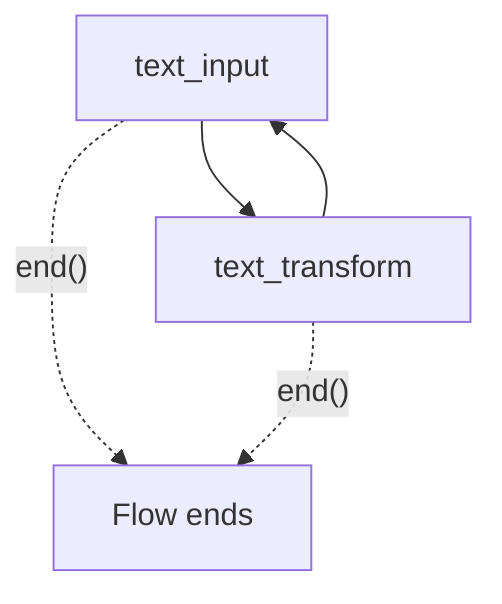
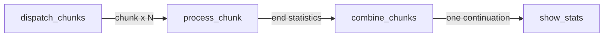
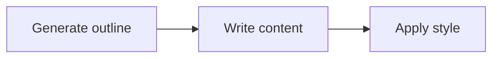
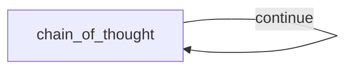
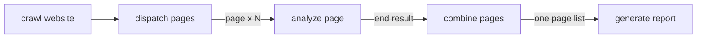
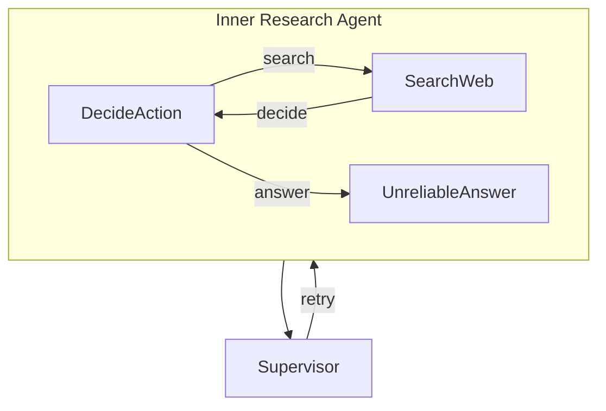
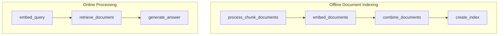

# Python Examples

The [cookbook](https://github.com/jigmd/sley/tree/main/cookbook) teaches one
pattern at a time. Start with the smallest example that introduces the concept
you need; complexity metadata is a rough navigation aid, not a quality score.

## Start Here

| Project                                                                                    | Complexity | Primary lesson                                  |
| ------------------------------------------------------------------------------------------ | ---------: | ----------------------------------------------- |
| [Hello World](https://github.com/jigmd/sley/tree/main/cookbook/python-hello-world)         |        2.5 | `@node`, state, and a normal zero-emission leaf |
| [Retry and Recovery](https://github.com/jigmd/sley/tree/main/cookbook/python-node)         |          3 | Node retry and local recovery                   |
| [Text Converter Flow](https://github.com/jigmd/sley/tree/main/cookbook/python-flow)        |          4 | Unlabelled links and deliberate `end()`         |
| [Shared Run State](https://github.com/jigmd/sley/tree/main/cookbook/python-communication)  |          4 | Communication through `context.state`           |
| [Article Workflow](https://github.com/jigmd/sley/tree/main/cookbook/python-workflow)       |        6.5 | A readable three-node linear workflow           |
| [Async Recipe Finder](https://github.com/jigmd/sley/tree/main/cookbook/python-async-basic) |        4.5 | Async handlers and ordinary awaited I/O         |

## Branching, Loops, and Combining

| Project                                                                                                             | Complexity | Primary lesson                              |
| ------------------------------------------------------------------------------------------------------------------- | ---------: | ------------------------------------------- |
| [Sequential Batch Translation](https://github.com/jigmd/sley/tree/main/cookbook/python-batch)                       |          4 | Repeated emissions with serial scheduling   |
| [Combine CSV Chunks](https://github.com/jigmd/sley/tree/main/cookbook/python-batch-node)                            |        4.5 | Worker `end(value)` and Flow combine        |
| [Parallel Batch Translation](https://github.com/jigmd/sley/tree/main/cookbook/python-parallel-batch)                |          5 | The same fan-out with local concurrency     |
| [Reusable Batch Flow](https://github.com/jigmd/sley/tree/main/cookbook/python-batch-flow)                           |          6 | Reusing a nested Flow for branch work       |
| [Sequential and Parallel Nested Flows](https://github.com/jigmd/sley/tree/main/cookbook/python-parallel-batch-flow) |          7 | Local nested-scope concurrency              |
| [Majority Vote](https://github.com/jigmd/sley/tree/main/cookbook/python-majority-vote)                              |          6 | Combining several terminal outputs          |
| [Explicit Map/Reduce](https://github.com/jigmd/sley/tree/main/cookbook/python-map-reduce)                           |          8 | Map and Reduce as visible application nodes |
| [Nested Batch](https://github.com/jigmd/sley/tree/main/cookbook/python-nested-batch)                                |        9.5 | Two levels of scoped fan-out and combine    |
| [Partial Batch Recovery](https://github.com/jigmd/sley/tree/main/cookbook/python-resilient-batch)                   |          6 | Flow recovery with settled branch terminals |

## Agents and Reasoning

| Project                                                                                   | Complexity | Primary lesson                                        |
| ----------------------------------------------------------------------------------------- | ---------: | ----------------------------------------------------- |
| [Research Agent](https://github.com/jigmd/sley/tree/main/cookbook/python-agent)           |          7 | Named decisions, search loop, and answer path         |
| [Chain of Thought](https://github.com/jigmd/sley/tree/main/cookbook/python-thinking)      |          7 | A bounded reasoning self-loop and whole-handler retry |
| [Multi-Agent Taboo](https://github.com/jigmd/sley/tree/main/cookbook/python-multi-agent)  |          7 | Independent Flows communicating through queues        |
| [MCP Tools](https://github.com/jigmd/sley/tree/main/cookbook/python-mcp)                  |          8 | Tool discovery, selection, and execution              |
| [Research Supervisor](https://github.com/jigmd/sley/tree/main/cookbook/python-supervisor) |         13 | Nested Flow exits and supervisor retry                |
| [Agent-to-Agent Adapter](https://github.com/jigmd/sley/tree/main/cookbook/python-a2a)     |         12 | Exposing a Flow through an external task protocol     |

## Retrieval and Structured Data

| Project                                                                                           | Complexity | Primary lesson                              |
| ------------------------------------------------------------------------------------------------- | ---------: | ------------------------------------------- |
| [Structured Output](https://github.com/jigmd/sley/tree/main/cookbook/python-structured-output)    |          3 | Parse and validate before committing state  |
| [SQLite Tool](https://github.com/jigmd/sley/tree/main/cookbook/python-tool-database)              |          5 | A linear database workflow                  |
| [Text to SQL](https://github.com/jigmd/sley/tree/main/cookbook/python-text2sql)                   |          8 | Schema inspection and a repair loop         |
| [Chat with Memory Retrieval](https://github.com/jigmd/sley/tree/main/cookbook/python-chat-memory) |          7 | Recent history plus vector retrieval        |
| [RAG](https://github.com/jigmd/sley/tree/main/cookbook/python-rag)                                |         16 | Offline indexing and online retrieval Flows |

## Tools and Media

| Project                                                                                      | Complexity | Primary lesson                                   |
| -------------------------------------------------------------------------------------------- | ---------: | ------------------------------------------------ |
| [OpenAI Embeddings](https://github.com/jigmd/sley/tree/main/cookbook/python-tool-embeddings) |          3 | Keeping a provider call outside graph definition |
| [Web Search](https://github.com/jigmd/sley/tree/main/cookbook/python-tool-search)            |          5 | Linear search and analysis tools                 |
| [PDF Vision Batch](https://github.com/jigmd/sley/tree/main/cookbook/python-tool-pdf-vision)  |          6 | Page fan-out and vision extraction               |
| [Web Crawler](https://github.com/jigmd/sley/tree/main/cookbook/python-tool-crawler)          |        9.5 | Crawl, analyze, combine, and report              |
| [LLM Streaming](https://github.com/jigmd/sley/tree/main/cookbook/python-llm-streaming)       |          4 | Provider streaming and user interruption         |
| [Voice Chat](https://github.com/jigmd/sley/tree/main/cookbook/python-voice-chat)             |          7 | Speech input, response, and playback loop        |
| [Flow Visualization](https://github.com/jigmd/sley/tree/main/cookbook/python-visualization)  |          7 | Rendering `compile().describe()` topology        |

## Interactive Applications

| Project                                                                                          | Complexity | Primary lesson                                    |
| ------------------------------------------------------------------------------------------------ | ---------: | ------------------------------------------------- |
| [Simple Chat](https://github.com/jigmd/sley/tree/main/cookbook/python-chat)                      |          3 | One node with a named self-link                   |
| [Travel Chat Guardrail](https://github.com/jigmd/sley/tree/main/cookbook/python-chat-guardrail)  |          5 | Validation before a model call                    |
| [Streamlit Human Review](https://github.com/jigmd/sley/tree/main/cookbook/python-streamlit-hitl) |          4 | UI-owned staged human review                      |
| [FastAPI Human Review](https://github.com/jigmd/sley/tree/main/cookbook/python-fastapi-hitl)     |          8 | Waiting for external approval in an async handler |

The projects intentionally mix typed and untyped code. Types live in one file
when they clarify the lesson; they are omitted when they would obscure it.

See the [complexity rubric](./points.md) for how cognitive load is estimated.

## Project Details

The full lessons below are generated from each project's README so the catalog
stays useful without duplicating hand-maintained prose.

<!-- generated-project-details:start -->

### Sley Hello World ([python-hello-world](https://github.com/jigmd/sley/tree/main/cookbook/python-hello-world))

**Complexity:** 2.5

<details>
<summary>Read the full lesson</summary>

Your first Sley application! This simple example demonstrates how to create a basic Sley app from scratch.

## Run

Set `OPENAI_API_KEY`, then run:

```bash
pip install -r requirements.txt
python main.py
```

## Project Structure

```
.
├── docs/          # Documentation files
├── utils/         # Utility functions
├── flow.py        # Sley implementation
├── main.py        # Main application entry point
├── models.py      # Optional state typing
└── README.md      # Project documentation
```

## What This Example Demonstrates

- Turn an ordinary function into a node with `@node`
- Read and write the run's state through `context.state`
- Finish an ordinary leaf by emitting nothing

The `answer` handler has no outgoing link and makes no control call. Its normal
return exits the Flow. Most leaf nodes do not need `context.end()`.

This is the typed example in this group. Its single state definition lives in
`models.py`, which can be skipped when focusing on the workflow.

## Additional Resources

- [Sley Documentation](https://github.com/jigmd/sley/tree/main/docs)

</details>

### Simple Chat ([python-chat](https://github.com/jigmd/sley/tree/main/cookbook/python-chat))

**Complexity:** 3

<details>
<summary>Read the full lesson</summary>

A terminal chat built from one node and one named self-link:

```python
chat.link(chat, "continue")
```

Each turn appends messages to `context.state` and emits `"continue"`. Typing
`exit` returns without an emission, so the branch leaves the Flow and the chat
ends.

## Run

```bash
export OPENAI_API_KEY="your-api-key"
pip install -r requirements.txt
python main.py
```

</details>

### Retry and Recovery ([python-node](https://github.com/jigmd/sley/tree/main/cookbook/python-node))

**Complexity:** 3

<details>
<summary>Read the full lesson</summary>

This example summarizes text with one function-backed node. It shows the two
policies commonly attached to a node occurrence:

- `RetryPolicy(max_attempts=3)` retries a failed handler up to three total
  attempts.
- `recover=` runs after retry is declined or exhausted. Its `emit()` marks the
  failure handled and lets the Flow finish normally.

Retries repeat the whole handler, so perform validation before state changes or
external effects when those operations are not safe to repeat.

This is the second typed Python example after `python-hello-world`. Its small
state definition lives in `models.py`, leaving retry and recovery visible in
`flow.py`.

## Run

```bash
pip install -r requirements.txt
python main.py
```

Set your OpenAI API key in `utils/call_llm.py` before running against the live
service.

</details>

### Structured Output ([python-structured-output](https://github.com/jigmd/sley/tree/main/cookbook/python-structured-output))

**Complexity:** 3

<details>
<summary>Read the full lesson</summary>

This single-node Flow asks an LLM for YAML, parses it, validates the required
shape, and only then stores the result in `context.state`.

The node uses `RetryPolicy(max_attempts=3)`. Sley retries the whole handler, so the
validation happens before the state write. A malformed response can be retried
without publishing partial structured data.

## Run

```bash
export OPENAI_API_KEY="your-api-key"
pip install -r requirements.txt
python main.py
```

Edit `data.txt` to try another resume.

</details>

### OpenAI Embeddings ([python-tool-embeddings](https://github.com/jigmd/sley/tree/main/cookbook/python-tool-embeddings))

**Complexity:** 3

<details>
<summary>Read the full lesson</summary>

This example keeps the OpenAI call in `tools/embeddings.py` and wraps it with a
single Sley handler. The handler reads text from `context.state` and stores
the embedding in the same run state. `run()` returns that final state to the
caller.

## Run

```bash
export OPENAI_API_KEY="your-api-key"
pip install -r requirements.txt
python main.py
```

</details>

### Sequential Batch Translation ([python-batch](https://github.com/jigmd/sley/tree/main/cookbook/python-batch))

**Complexity:** 4

<details>
<summary>Read the full lesson</summary>

`dispatch` emits one `(text, language)` input for every requested translation.
Those emissions create independent branches, but `Flow(dispatch)` has the
default concurrency of one, so the translator handles them sequentially.

Each worker calls `end()` after writing its file. That ends only that branch;
the other translations continue until the Flow has no live work.

The generated translations are intentionally not checked into the repository:
they describe whichever README version was translated and become stale quickly.
Running the example creates eight `translations/README_*.md` files; cookbook
verification checks that all eight are produced in an isolated project copy.

## Run

```bash
export ANTHROPIC_API_KEY="your-api-key"
pip install -r requirements.txt
python main.py
```

</details>

### Shared Run State ([python-communication](https://github.com/jigmd/sley/tree/main/cookbook/python-communication))

**Complexity:** 4

<details>
<summary>Read the full lesson</summary>

This word counter shows how nodes communicate through `context.state`.
`read_text` initializes a nested statistics dictionary, `count_words` updates
it, and `show_stats` reads it before linking back for another input.

All nodes in one run see the same top-level state object. Sley shallow-copies
the initial dictionary when `run()` starts and returns the run-owned state when
the Flow finishes.

## Run

```bash
pip install -r requirements.txt
python main.py
```

Enter text to update the totals, or `q` to finish the Flow.

</details>

### Text Converter Flow ([python-flow](https://github.com/jigmd/sley/tree/main/cookbook/python-flow))

**Complexity:** 4

<details>
<summary>Read the full lesson</summary>

This project demonstrates an interactive text transformation tool built with Sley.

## Run

```bash
pip install -r requirements.txt
python main.py
```

## Features

- Convert text to UPPERCASE
- Convert text to lowercase
- Reverse text
- Remove extra spaces
- Interactive command-line interface
- Continuous flow with option to process multiple texts

## How It Works

The workflow features an interactive loop with branching paths:



The two ordinary returns follow the unlabelled links and keep the loop moving.
Calling `context.end()` creates a hard terminal instead, so the same links are
not followed. The nearby `return` only skips the remaining Python statements;
`end()` itself records the terminal.

Here's what each node does:

1. **`text_input`**: Collects text input and handles menu choices
2. **`text_transform`**: Applies the selected transformation to the text

## Example Output

```
Welcome to Text Converter!
=========================

Enter text to convert: Sley is a 100-line LLM framework

Choose transformation:
1. Convert to UPPERCASE
2. Convert to lowercase
3. Reverse text
4. Remove extra spaces
5. Exit

Your choice (1-5): 1

Result: SLEY IS A 100-LINE LLM FRAMEWORK

Convert another text? (y/n): n

Thank you for using Text Converter!
```

## Files

- [`main.py`](./main.py): Main entry point for running the text converter
- [`flow.py`](./flow.py): Defines the nodes and flow for text transformation
- [`requirements.txt`](./requirements.txt): Lists the required dependencies

</details>

### LLM Streaming and Interruption ([python-llm-streaming](https://github.com/jigmd/sley/tree/main/cookbook/python-llm-streaming))

**Complexity:** 4

<details>
<summary>Read the full lesson</summary>

One Sley node prints an OpenAI stream while a small listener thread waits for
ENTER. The example keeps user-driven stream interruption inside the tool code;
the Flow itself remains a normal one-node workflow.

## Run

```bash
export OPENAI_API_KEY="your-api-key"
pip install -r requirements.txt
python main.py
```

Press ENTER while text is streaming to stop reading further chunks.

</details>

### Streamlit Human Review ([python-streamlit-hitl](https://github.com/jigmd/sley/tree/main/cookbook/python-streamlit-hitl))

**Complexity:** 4

<details>
<summary>Read the full lesson</summary>

A small Streamlit application with three UI stages: submit, review, and
complete.

Streamlit owns the pause while a person reviews the output. Sley runs one
Flow to process the input and another after approval to finalize it. Each call
stores the state returned by `run()` back into `st.session_state`.

## Run

```bash
pip install -r requirements.txt
streamlit run app.py
```

</details>

### Async Recipe Finder ([python-async-basic](https://github.com/jigmd/sley/tree/main/cookbook/python-async-basic))

**Complexity:** 4.5

<details>
<summary>Read the full lesson</summary>

This example uses ordinary `async` handlers for real local I/O:

1. Collect an ingredient from the terminal without blocking the event loop.
2. Read a local recipe catalog without blocking the event loop.
3. Ask whether to accept the suggestion or follow the `retry` link.

The Flow deliberately mixes async I/O handlers with a synchronous suggestion
handler. All of them read and write the same run state. `approve` emits only
when retrying; a successful return with no emission exits the Flow normally.

```python
fetch.link(suggest, "suggest")
suggest.link(approve, "approve")
approve.link(suggest, "retry")
```

## Run

```bash
pip install -r requirements.txt
python main.py
```

</details>

### Combine CSV Chunks ([python-batch-node](https://github.com/jigmd/sley/tree/main/cookbook/python-batch-node))

**Complexity:** 4.5

<details>
<summary>Read the full lesson</summary>

This example processes a sales CSV in chunks and combines their statistics into
one result.

## Run

```bash
pip install -r requirements.txt
python main.py
```

## What This Example Demonstrates

1. `dispatch_chunks` emits one branch input for each CSV chunk.
2. `process_chunk` calls `end(value)` to publish one output from its branch.
3. `combine_chunks` receives those values in `result.outputs` and sums them.
4. Its single `emit()` replaces all worker terminals with one continuation, so
   `show_stats` runs once.

`end(value)` ends only that worker branch. It does not stop sibling workers or
the whole run. The Flow's `combine` callback runs after every branch in that Flow
has settled. The outer Flow gives the combiner's single continuation a
`show_stats` node to follow.



## Files

- [`main.py`](./main.py): Runs the example
- [`flow.py`](./flow.py): Builds the fan-out Flow and defines its combiner
- [`nodes.py`](./nodes.py): Contains the three small handler functions
- [`data/sales.csv`](./data/sales.csv): Sample sales data

</details>

### Travel Chat Guardrail ([python-chat-guardrail](https://github.com/jigmd/sley/tree/main/cookbook/python-chat-guardrail))

**Complexity:** 5

<details>
<summary>Read the full lesson</summary>

A travel assistant that validates each question before sending it to the main
chat model.

The guardrail routes valid questions to `answer_question` and invalid questions
back to `read_question`:

```python
validate_question.link(read_question, "retry")
validate_question.link(answer_question, "answer")
```

Each `emit()` carries control to one named link. Typing `exit` makes
`read_question` return without an emission, so that branch leaves the Flow and
the chat ends.

## Run

```bash
export OPENAI_API_KEY="your-api-key"
pip install -r requirements.txt
python main.py
```

</details>

### Parallel Batch Translation ([python-parallel-batch](https://github.com/jigmd/sley/tree/main/cookbook/python-parallel-batch))

**Complexity:** 5

<details>
<summary>Read the full lesson</summary>

This is the concurrent counterpart to `python-batch`. The graph is the same:
one dispatcher emits eight branch inputs and each translator ends its own branch
after writing a file.

The difference is local to the Flow definition:

```python
translation_flow = Flow(dispatch, concurrency=8)
```

The concurrency cap belongs to this Flow scope. Nested Flows apply their own
local limits.

The generated translations are intentionally not checked into the repository:
they describe whichever README version was translated and become stale quickly.
Running the example creates eight `translations/README_*.md` files; cookbook
verification checks that all eight are produced in an isolated project copy.

## Run

```bash
export ANTHROPIC_API_KEY="your-api-key"
pip install -r requirements.txt
python main.py
```

</details>

### SQLite Tool ([python-tool-database](https://github.com/jigmd/sley/tree/main/cookbook/python-tool-database))

**Complexity:** 5

<details>
<summary>Read the full lesson</summary>

Three nodes form a linear database workflow:

1. Initialize the SQLite schema.
2. Insert one task with bound query parameters.
3. Read the tasks into the final run state.

The SQLite functions stay in `tools/database.py`; the Sley handlers only
adapt shared state to those tool calls. Successful handlers emit nothing, so
each follows its unlabelled link automatically.

## Run

```bash
pip install -r requirements.txt
python main.py
```

</details>

### Web Search with Analysis ([python-tool-search](https://github.com/jigmd/sley/tree/main/cookbook/python-tool-search))

**Complexity:** 5

<details>
<summary>Read the full lesson</summary>

This linear Flow separates orchestration from tools:

1. `search` calls SerpAPI and stores the results.
2. Its unlabelled link runs `analyze`, which asks an LLM for a YAML summary.

The Sley handlers in `nodes.py` make the workflow visible; API-specific code
stays in `tools/`.

## Run

```bash
export SERPAPI_API_KEY="your-serpapi-key"
export OPENAI_API_KEY="your-openai-key"
pip install -r requirements.txt
python main.py
```

</details>

### Reusing a Flow for Batch Work ([python-batch-flow](https://github.com/jigmd/sley/tree/main/cookbook/python-batch-flow))

**Complexity:** 6

<details>
<summary>Read the full lesson</summary>

The dispatcher emits nine image/filter jobs into one nested `process_image`
Flow. Each nested invocation runs the same three handlers:

```text
load -> apply filter -> save
```

The job and intermediate image travel through `context.input`; shared run state
is unnecessary. Each save calls `end(path)`, ending that worker branch and
recording its output. The outer Flow uses concurrency one, so jobs run in order.

## Run

```bash
pip install -r requirements.txt
python main.py
```

</details>

### Majority Vote Reasoning ([python-majority-vote](https://github.com/jigmd/sley/tree/main/cookbook/python-majority-vote))

**Complexity:** 6

<details>
<summary>Read the full lesson</summary>

The dispatcher emits several copies of one question. Each solver branch calls
`end(answer)`, publishing an answer as a terminal output.

After every branch settles, the Flow's `combine=` callback runs once. It reads
`result.outputs`, chooses the most frequent answer, stores it in shared state,
and calls `end(best_answer)`. That final call replaces the many worker terminals
with one aggregate terminal.

## Run

```bash
export ANTHROPIC_API_KEY="your-api-key"
pip install -r requirements.txt
python main.py --tries 5
```

</details>

### Recovering a Partially Completed Batch ([python-resilient-batch](https://github.com/jigmd/sley/tree/main/cookbook/python-resilient-batch))

**Complexity:** 6

<details>
<summary>Read the full lesson</summary>

This example imports three records in order. The first succeeds, the second has
an invalid amount, and the third is never started after the Flow fails.

The worker publishes each successful import with `end(value)`. When the next
worker raises, the Flow's `recover=` callback receives a `ScopeFailure` whose
`terminals` contain the already-completed import. Recovery keeps that result and
calls `end(summary)`, explicitly replacing the failure with one successful batch
terminal.

The example uses `start(...).result()` instead of the everyday `run()` shortcut
so the final `Completed` or `Failed` status and terminals remain visible.

```text
record 1 -> end(imported record)
record 2 -> failure
record 3 -> not admitted
                 |
                 v
              recover -> end(partial summary)
```

## Run

```bash
pip install -r requirements.txt
python main.py
```

Removing the recovery control call would leave the failure unhandled and produce
a `Failed` result instead.

</details>

### PDF Vision Batch ([python-tool-pdf-vision](https://github.com/jigmd/sley/tree/main/cookbook/python-tool-pdf-vision))

**Complexity:** 6

<details>
<summary>Read the full lesson</summary>

Convert every PDF page to an image and extract its text with OpenAI's vision
model.

`dispatch_pdfs` emits one branch input per file. Each `process_pdf` branch ends
with one file result. After every branch settles, the Flow's `combine` callback
collects `result.outputs` into the final run state.

This is the complete batch shape:

```text
dispatch_pdfs --process--> process_pdf --end(file_result)--> combine
```

## Run

```bash
export OPENAI_API_KEY="your-api-key"
pip install -r requirements.txt
python main.py
```

</details>

### Article Writing Workflow ([python-workflow](https://github.com/jigmd/sley/tree/main/cookbook/python-workflow))

**Complexity:** 6.5

<details>
<summary>Read the full lesson</summary>

A three-step workflow that asks an LLM to outline, draft, and polish an article.



Each node reads and writes the same run state. A successful handler that emits
nothing follows its unlabelled link, so the workflow needs no explicit control
calls. The final node has no link, so its normal completion exits the Flow.

`run()` returns the completed state. The caller must use that returned value
because Sley shallow-copies the initial top-level mapping.

## Run

```bash
export OPENAI_API_KEY="your-api-key"
pip install -r requirements.txt
python main.py "AI Safety"
```

</details>

### Research Agent ([python-agent](https://github.com/jigmd/sley/tree/main/cookbook/python-agent))

**Complexity:** 7

<details>
<summary>Read the full lesson</summary>

This agent has three function-backed nodes:

```text
decide --search--> search --decide--> decide
   |
   +--answer--> answer
```

The decision node validates the LLM's YAML before emitting a named action.
Search results accumulate in shared run state. The answer node emits nothing,
so it exits the Flow normally and `run()` returns the final state.

Open [the Colab tutorial](https://colab.research.google.com/github/jigmd/sley/blob/main/cookbook/python-agent/demo.ipynb)
to build and run the same agent one step at a time in the browser. Run
`python utils.py` locally to try the LLM and search integrations without the
Flow.

## Run

```bash
export OPENAI_API_KEY="your-api-key"
pip install -r requirements.txt
python main.py
python main.py --"What is quantum computing?"
```

</details>

### Chat with Memory Retrieval ([python-chat-memory](https://github.com/jigmd/sley/tree/main/cookbook/python-chat-memory))

**Complexity:** 7

<details>
<summary>Read the full lesson</summary>

A chat that keeps three recent conversation pairs and archives older pairs in a
vector index.

The current question travels through `context.input`. Conversation history and
the vector index live in `context.state` because every turn needs them. Once the
active history grows past three pairs, `answer_question` sends the oldest pair
to `archive_memory` before the next turn:

```python
context.emit("archive", oldest_pair)
```

Named links make the two possible paths visible: answer another question
directly, or archive a pair first.

## Run

```bash
export OPENAI_API_KEY="your-api-key"
pip install -r requirements.txt
python main.py
```

</details>

### Multi-Agent Taboo Game ([python-multi-agent](https://github.com/jigmd/sley/tree/main/cookbook/python-multi-agent))

**Complexity:** 7

<details>
<summary>Read the full lesson</summary>

Two independent Flows run concurrently. The hinter and guesser each have a
named self-link for their next turn, while two injected `asyncio.Queue` objects
carry messages between the runs.

Sley shallow-copies the top-level state for each run. Nested values are borrowed,
so both runs deliberately receive the same queues and `past_guesses` list. This
is application-managed communication, not shared Sley scheduler state.

When the guess is correct, both handlers return without emitting. Their Flows
then finish normally.

## Run

```bash
export OPENAI_API_KEY="your-api-key"
pip install -r requirements.txt
python main.py
```

</details>

### Sequential and Parallel Nested Flows ([python-parallel-batch-flow](https://github.com/jigmd/sley/tree/main/cookbook/python-parallel-batch-flow))

**Complexity:** 7

<details>
<summary>Read the full lesson</summary>

This example builds the same reusable image-processing Flow twice. One outer
Flow has `concurrency=1`; the other has `concurrency=9`.

Each emitted image/filter input starts a nested Flow:

```text
load -> apply filter -> save -> end(path)
```

The graph and handlers do not change between the sequential and parallel runs.
Only the owning Flow's local concurrency cap changes. Fresh node occurrences are
created for each graph because links belong to occurrences, not handler
functions.

## Run

```bash
pip install -r requirements.txt
python main.py
```

</details>

### Chain-of-Thought ([python-thinking](https://github.com/jigmd/sley/tree/main/cookbook/python-thinking))

**Complexity:** 7

<details>
<summary>Read the full lesson</summary>

This project demonstrates an implementation that orchestrates a Chain-of-Thought process, enabling LLMs to solve complex reasoning problems by thinking step-by-step. It's designed to improve problem-solving accuracy through deliberate, structured reasoning managed externally.

This implementation is based on this tutorial (for Pocketflow): [Build Chain-of-Thought From Scratch - Tutorial for Dummies](https://zacharyhuang.substack.com/p/build-chain-of-thought-from-scratch).

## Run

Set `ANTHROPIC_API_KEY`, then run:

```bash
pip install -r requirements.txt
python main.py
```

## Features

- Improves model reasoning on complex problems.
- Leverages capable instruction-following models (e.g., Claude 3.7 Sonnet, GPT-4 series) to perform structured Chain-of-Thought reasoning.
- Solves problems that direct prompting often fails on by breaking them down systematically.
- Provides detailed reasoning traces, including step-by-step evaluation and planning, for verification.

## How It Works

The implementation uses a function-backed, self-looping Sley node occurrence
(`chain_of_thought`) that guides an LLM through a structured problem-solving
process:



In each loop (thought step), the node directs the LLM to:

1.  Evaluate the previous thought's reasoning and results.
2.  Execute the next pending step according to a maintained plan.
3.  Update the plan, marking the step done (with results) or noting issues.
4.  Refine the plan if steps need breaking down or errors require correction.
5.  Decide if further thinking (`next_thought_needed`) is required based on the plan state.

This external orchestration enforces a systematic approach, helping models tackle problems that are difficult with a single prompt.

When another thought is needed, the function emits `"continue"` to follow its
self-loop. A conclusion emits nothing, so the root Flow ends normally. It does
not call `end()` because this is an ordinary leaf, not a hard terminal carrying
a branch output.

The Flow keeps the original limit of 50 node visits as `max_activations=50` and
makes up to three attempts at a failed thought. Sley retries the whole function,
so it stores the new thought only after the model response has been parsed.

## Comparison with Different Approaches

- **Standard Prompting**: Techniques like asking the model to "think step by step" within a single prompt can help, but the reasoning might lack depth or structure, and the model can easily lose track or make unrecoverable errors.
- **Native Extended Thinking Modes**: Some models (like Claude 3.7, GPT-o1, etc.) offer dedicated modes or features explicitly for extended reasoning, often yielding strong results directly via API calls.
- **This Implementation**: Demonstrates how to orchestrate a structured Chain-of-Thought process using standard LLMs (even those without a specific native 'extended thinking' mode), managing the steps, planning, and evaluation externally via prompt engineering and flow control.

## Example Thinking Process

Let's try out this challenging [Jane Street Quant Trading Interview Question](https://www.youtube.com/watch?v=gQJTkuEVPrU):

> **Problem**: You keep rolling a fair die until you roll three, four, five in that order consecutively on three rolls. What is the probability that you roll the die an odd number of times?

This problem demonstrates why structured Chain-of-Thought is valuable:

- **Standard models (single prompt)**: Often get the wrong answer or provide flawed reasoning.
- **Models using native thinking modes**: Can find the correct answer (216/431 ≈ 0.5012), though performance and reasoning clarity may vary.
- **This implementation (orchestrating a capable LLM)**: Can guide the model towards the correct answer by enforcing a step-by-step plan, evaluation, and refinement loop.

For comparison:

- [Claude 3.7 Sonnet (single prompt)](https://claude.ai/share/da139326-42fe-42d9-9d7b-35870daa5c1b): Wrong answer
- [Claude 3.7 Sonnet (using built-in thinking)](https://claude.ai/share/6f4140ed-f33c-4949-8778-a57719498e40): Correct answer after 3m, 45s
- [GPT-o1 (using built-in thinking)](https://chatgpt.com/share/67fee0fd-2600-8000-bcdf-76e40a986ee4): Correct answer after 2m, 0s
- [GPT-o1 pro (using built-in thinking)](https://chatgpt.com/share/67fee11b-530c-8000-92d1-609b6ca49c9c): Correct answer after 4m, 24s

Below is an example output trace showing how **this implementation guides Claude 3.7 Sonnet** through the problem-solving process:

> **Note:** Even with structured thinking orchestration, models don't always get the right answer, especially on very complex or novel problems. However, this approach significantly improves the robustness of the reasoning process and provides a traceable path for verification and debugging.

```
🤔 Processing question: You keep rolling a fair die until you roll three, four, five in that order consecutively on three rolls. What is the probability that you roll the die an odd number of times?

Thought 1:
  Let me think through this problem by setting up a clear approach.

  We need to find the probability that the total number of die rolls will be odd, given we stop when we roll "3,4,5" consecutively in that order.

  This is a problem about a stochastic process that ends when a specific pattern occurs. To solve it, I'll:
  1. Set up a Markov chain model to track progress toward the target sequence
  2. Calculate expected lengths and probabilities for different outcomes
  3. Determine if the total number of rolls has equal probability of being odd vs. even

  First, I need to understand what states we can be in while rolling the die:
  - State 0: Haven't rolled any of the sequence yet
  - State 1: Just rolled a 3, waiting for 4
  - State 2: Rolled 3 followed by 4, waiting for 5
  - State 3: Success! Rolled the full "3,4,5" sequence

  When the die is rolled, we transition between these states with certain probabilities. Each state depends only on the previous 0-2 rolls, making this a Markov process.

Current Plan Status:
    - [Done] Understand the problem structure: Identified that we need the probability of an odd number of total rolls until getting '3,4,5' consecutively. Set up a Markov chain with states representing progress toward target sequence.
    - [Pending] Set up the Markov model with transition probabilities
      - [Pending] Define relevant states in the Markov chain
      - [Pending] Calculate transition probabilities between states
    - [Pending] Calculate generating functions for the process
    - [Pending] Determine probability of odd number of rolls
      - [Pending] Extract coefficient information from generating function
      - [Pending] Compute final probability value
    - [Pending] Verify solution with alternative approach
    - [Pending] Conclusion
--------------------------------------------------

Thought 2:
  Evaluation of Thought 1: Correct. The approach of using a Markov chain to model this problem is appropriate. Identifying the states (0: no part of sequence, 1: just rolled 3, 2: rolled 3,4, 3: success with 3,4,5) correctly captures the progression toward our target sequence.

  I'll now set up the Markov model with transition probabilities. Each state represents our progress toward the target sequence "3,4,5".

  State 0: Haven't rolled any relevant part of the sequence yet
  - If we roll a 3: Move to State 1 (probability 1/6)
  - If we roll anything else: Stay in State 0 (probability 5/6)

  State 1: Just rolled a 3, waiting for a 4
  - If we roll a 4: Move to State 2 (probability 1/6)
  - If we roll a 3: Stay in State 1 (probability 1/6)
  - If we roll anything else: Return to State 0 (probability 4/6)

  State 2: Rolled 3 followed by 4, waiting for a 5
  - If we roll a 5: Move to State 3 (success - probability 1/6)
  - If we roll a 3: Move to State 1 (probability 1/6)
  - If we roll anything else: Return to State 0 (probability 4/6)

  State 3: Success! Rolled the sequence "3,4,5"
  - This is an absorbing state; once we reach it, we stop rolling.

  These transition probabilities can be represented as a matrix:
  P = [
      [5/6, 1/6, 0,   0  ],
      [4/6, 1/6, 1/6, 0  ],
      [4/6, 1/6, 0,   1/6],
      [0,   0,   0,   1  ]
  ]

  This completes the setup of the Markov model with transition probabilities.

Current Plan Status:
    - [Done] Understand the problem structure: Identified that we need the probability of an odd number of total rolls until getting '3,4,5' consecutively. Set up a Markov chain with states representing progress toward target sequence.
    - [Done] Set up the Markov model with transition probabilities: Defined 4 states (0: no sequence, 1: just rolled 3, 2: rolled 3,4, 3: success with 3,4,5) and calculated transition probabilities between all states in matrix form.
    - [Pending] Calculate generating functions for the process
      - [Pending] Set up generating function equations for each state
      - [Pending] Solve the system of equations to find generating functions
    - [Pending] Determine probability of odd number of rolls
      - [Pending] Extract coefficient information from generating function
      - [Pending] Compute final probability value
    - [Pending] Verify solution with alternative approach
    - [Pending] Conclusion
--------------------------------------------------

Thought 3:
  Evaluation of Thought 2: Correct. The Markov chain setup with the four states and the transition probability matrix accurately represents our problem. Now I'll proceed to calculating the generating functions for this process.

  To calculate the generating functions, I'll use the variable z to represent a single die roll. For each state, the generating function gives us information about the number of rolls until we reach our success state.

  Let G₀(z), G₁(z), G₂(z), and G₃(z) be the generating functions for reaching the success state (State 3) when starting from State 0, 1, 2, and 3 respectively.

  G₃(z) = 1 (since we're already in the success state)

  For the other states, we can write equations based on the first roll and subsequent state:

  G₀(z) = z·(5/6·G₀(z) + 1/6·G₁(z))
  This means: we roll once (factor z), then with probability 5/6 we stay in State 0, or with probability 1/6 we move to State 1.

  G₁(z) = z·(4/6·G₀(z) + 1/6·G₁(z) + 1/6·G₂(z))
  When in State 1, we roll once (factor z), then either move to State 0, stay in State 1, or advance to State 2.

  G₂(z) = z·(4/6·G₀(z) + 1/6·G₁(z) + 1/6·G₃(z))
      = z·(4/6·G₀(z) + 1/6·G₁(z) + 1/6·1)
      = z·(4/6·G₀(z) + 1/6·G₁(z) + 1/6)

  Now I can solve this system of equations for G₀(z):

  From G₀(z) = z·(5/6·G₀(z) + 1/6·G₁(z)):
  G₀(z) - 5z/6·G₀(z) = z/6·G₁(z)
  G₀(z)(1 - 5z/6) = z/6·G₁(z)
  G₀(z) = (z/6·G₁(z))/(1 - 5z/6) ... (1)

  From G₁(z) = z·(4/6·G₀(z) + 1/6·G₁(z) + 1/6·G₂(z)):
  G₁(z) - z/6·G₁(z) = 4z/6·G₀(z) + z/6·G₂(z)
  G₁(z)(1 - z/6) = 4z/6·G₀(z) + z/6·G₂(z) ... (2)

  From G₂(z) = z·(4/6·G₀(z) + 1/6·G₁(z) + 1/6):
  G₂(z) = 4z/6·G₀(z) + z/6·G₁(z) + z/6 ... (3)

  Substituting (3) into (2):
  G₁(z)(1 - z/6) = 4z/6·G₀(z) + z/6·(4z/6·G₀(z) + z/6·G₁(z) + z/6)
  G₁(z)(1 - z/6) = 4z/6·G₀(z) + 4z²/36·G₀(z) + z²/36·G₁(z) + z²/36
  G₁(z)(1 - z/6 - z²/36) = 4z/6·G₀(z)(1 + z/6) + z²/36
  G₁(z) = (4z/6·G₀(z)(1 + z/6) + z²/36)/(1 - z/6 - z²/36) ... (4)

  Substituting (4) into (1) gives us G₀(z) in terms of z only, which I can then simplify to find the closed form.

  This is getting algebraically intricate. Let me take a step back and consider a different approach using first-step analysis with parity.

Current Plan Status:
    - [Done] Understand the problem structure: Identified that we need probability of an odd number of total rolls until getting '3,4,5' consecutively. Set up a Markov chain with states representing progress toward target sequence.
    - [Done] Set up the Markov model with transition probabilities: Defined 4 states (0: no sequence, 1: just rolled 3, 2: rolled 3,4, 3: success with 3,4,5) and calculated transition probabilities between all states in matrix form.
    - [Verification Needed] Calculate generating functions for the process (The generating function approach became algebraically complicated. Consider a more direct approach using first-step analysis with parity.)
      - [Done] Set up generating function equations for each state: Established equations G₀(z), G₁(z), G₂(z), and G₃(z) to track rolls until success.
      - [Verification Needed] Solve the system of equations to find generating functions (Equations become unwieldy; may not be most efficient approach.)
    - [Pending] Use first-step analysis with parity
      - [Pending] Define probability variables with parity information
      - [Pending] Set up equations relating odd/even outcome probabilities
      - [Pending] Solve the system of equations
    - [Pending] Determine probability of odd number of rolls
      - [Pending] Extract final probability from analysis
      - [Pending] Verify the mathematical result
    - [Pending] Verify solution with alternative approach
    - [Pending] Conclusion
--------------------------------------------------

Thought 4:
  Evaluation of Thought 3: Correct, but pivoting is wise. The generating function approach, while theoretically sound, is becoming algebraically complex. The decision to switch to a first-step analysis with parity is appropriate for this problem.

  I'll now use first-step analysis focusing specifically on the parity of the number of rolls.

  Let's define:
  - P₀: Probability of rolling an odd number of times when starting in State 0
  - P₁: Probability of rolling an odd number of times when starting in State 1
  - P₂: Probability of rolling an odd number of times when starting in State 2

  Using first-step analysis, we can write equations for each state:

  For State 0:
  - If we roll a 3 (prob 1/6), we go to State 1 with 1 roll used (odd). The total number of rolls will be odd if the remaining rolls from State 1 are even.
  - If we roll anything else (prob 5/6), we stay in State 0 with 1 roll used (odd). The total will be odd if the remaining rolls from State 0 are even.

  Therefore: P₀ = (1/6)*(1-P₁) + (5/6)*(1-P₀) = 5/6 - 5P₀/6 + 1/6 - P₁/6

  For State 1:
  - If we roll a 4 (prob 1/6), we go to State 2 with 1 roll used (odd). The total will be odd if remaining rolls from State 2 are even.
  - If we roll a 3 (prob 1/6), we stay in State 1 with 1 roll used (odd). The total will be odd if remaining rolls from State 1 are even.
  - If we roll anything else (prob 4/6), we go to State 0 with 1 roll used (odd). The total will be odd if remaining rolls from State 0 are even.

  Therefore: P₁ = (1/6)*(1-P₂) + (1/6)*(1-P₁) + (4/6)*(1-P₀) = 1 - P₂/6 - P₁/6 - 4P₀/6

  For State 2:
  - If we roll a 5 (prob 1/6), we're done with 1 more roll (odd). Total is definitely odd.
  - If we roll a 3 (prob 1/6), we go to State 1 with 1 roll used (odd). The total will be odd if remaining rolls from State 1 are even.
  - If we roll anything else (prob 4/6), we go to State 0 with 1 roll used (odd). The total will be odd if remaining rolls from State 0 are even.

  Therefore: P₂ = (1/6)*1 + (1/6)*(1-P₁) + (4/6)*(1-P₀) = 1/6 + 1/6 - P₁/6 + 4/6 - 4P₀/6 = 6/6 - P₁/6 - 4P₀/6

  Now I have a system of 3 equations with 3 unknowns:
  P₀ = 1 - 5P₀/6 - P₁/6
  P₁ = 1 - P₁/6 - P₂/6 - 4P₀/6
  P₂ = 1 - P₁/6 - 4P₀/6

  Simplifying:
  (6/6)P₀ = 6/6 - 5P₀/6 - P₁/6
  (6/6)P₁ = 6/6 - P₁/6 - P₂/6 - 4P₀/6
  (6/6)P₂ = 6/6 - P₁/6 - 4P₀/6

  Further simplifying:
  11P₀/6 + P₁/6 = 1
  4P₀/6 + 7P₁/6 + P₂/6 = 1
  4P₀/6 + P₁/6 + 6P₂/6 = 1

  This is a linear system of equations that I can solve.

Current Plan Status:
    - [Done] Understand the problem structure: Identified that we need probability of an odd number of total rolls until getting '3,4,5' consecutively. Set up a Markov chain with states representing progress toward target sequence.
    - [Done] Set up the Markov model with transition probabilities: Defined 4 states (0: no sequence, 1: just rolled 3, 2: rolled 3,4, 3: success with 3,4,5) and calculated transition probabilities between all states in matrix form.
    - [Verification Needed] Calculate generating functions for the process (Approach became algebraically complicated; shifted to more direct first-step analysis with parity.)
      - [Done] Set up generating function equations for each state: Established equations G₀(z), G₁(z), G₂(z), and G₃(z) to track rolls until success.
      - [Verification Needed] Solve the system of equations to find generating functions (Equations became unwieldy; more efficient to use first-step analysis with parity instead.)
    - [Done] Use first-step analysis with parity: Defined variables P₀, P₁, P₂ for probability of odd rolls from each state. Set up system of equations tracking odd/even outcomes.
      - [Done] Define probability variables with parity information: Defined P₀, P₁, P₂ as probabilities of odd number of rolls starting from respective states.
      - [Done] Set up equations relating odd/even outcome probabilities: Derived equations: 11P₀/6 + P₁/6 = 1, 4P₀/6 + 7P₁/6 + P₂/6 = 1, 4P₀/6 + P₁/6 + 6P₂/6 = 1.
      - [Pending] Solve the system of equations
    - [Pending] Determine probability of odd number of rolls
      - [Pending] Extract final probability from analysis
      - [Pending] Verify the mathematical result
    - [Pending] Verify solution with alternative approach
    - [Pending] Conclusion
--------------------------------------------------

Thought 5:
  Evaluation of Thought 4: Correct. The first-step analysis with parity is well set up, with appropriate variables P₀, P₁, and P₂ representing the probability of rolling an odd number of times from each state. The system of equations is correctly derived, though I notice it's written in slightly different forms across the thought. Let me solve this system now.

  Taking the system of equations from the end of Thought 4:
  11P₀/6 + P₁/6 = 1
  4P₀/6 + 7P₁/6 + P₂/6 = 1
  4P₀/6 + P₁/6 + 6P₂/6 = 1

  Let's multiply all equations by 6 to eliminate fractions:
  11P₀ + P₁ = 6
  4P₀ + 7P₁ + P₂ = 6
  4P₀ + P₁ + 6P₂ = 6

  Subtracting the third equation from the second:
  (4P₀ + 7P₁ + P₂) - (4P₀ + P₁ + 6P₂) = 6 - 6
  6P₁ - 5P₂ = 0
  6P₁ = 5P₂
  P₁ = 5P₂/6

  From the first equation:
  11P₀ + P₁ = 6
  11P₀ + 5P₂/6 = 6
  66P₀ + 5P₂ = 36

  From the third equation:
  4P₀ + P₁ + 6P₂ = 6
  4P₀ + 5P₂/6 + 6P₂ = 6
  24P₀ + 5P₂ + 36P₂ = 36
  24P₀ + 41P₂ = 36

  Now solving for P₀ in terms of P₂:
  24P₀ + 41P₂ = 36
  24P₀ = 36 - 41P₂
  P₀ = (36 - 41P₂)/24 = 3/2 - 41P₂/24

  Substituting back into 66P₀ + 5P₂ = 36:
  66(3/2 - 41P₂/24) + 5P₂ = 36
  99/2 - 66*41P₂/24 + 5P₂ = 36
  99/2 - 2706P₂/24 + 5P₂ = 36
  99/2 - 2706P₂/24 + 120P₂/24 = 36
  99/2 - (2706-120)P₂/24 = 36
  99/2 - 2586P₂/24 = 36
  99 - 2586P₂/12 = 72
  99 - 72 = 2586P₂/12
  27 = 2586P₂/12
  27*12 = 2586P₂
  324 = 2586P₂
  P₂ = 324/2586 = 108/862 = 54/431

  Now we can find P₁:
  P₁ = 5P₂/6 = 5(54/431)/6 = 270/2586 = 45/431

  And P₀:
  P₀ = 3/2 - 41P₂/24 = 3/2 - 41(54/431)/24 = 3/2 - 2214/10344 = 3/2 - 1107/5172

  Let's calculate:
  P₀ = 3/2 - 1107/5172 = 7758/5172 - 1107/5172 = 6651/5172 = 2217/1724

  Now we have:
  P₀ = 2217/1724
  P₁ = 45/431
  P₂ = 54/431

  Wait, I see an error in my calculation. Let me restart with the system of equations.

  From the equations:
  11P₀/6 + P₁/6 = 1
  4P₀/6 + 7P₁/6 + P₂/6 = 1
  4P₀/6 + P₁/6 + 6P₂/6 = 1

  Multiplying by 6:
  11P₀ + P₁ = 6
  4P₀ + 7P₁ + P₂ = 6
  4P₀ + P₁ + 6P₂ = 6

  From the first: P₁ = 6 - 11P₀

  Substituting into the second:
  4P₀ + 7(6 - 11P₀) + P₂ = 6
  4P₀ + 42 - 77P₀ + P₂ = 6
  4P₀ - 77P₀ + P₂ = 6 - 42
  -73P₀ + P₂ = -36
  P₂ = -36 + 73P₀

  Substituting P₁ and P₂ into the third equation:
  4P₀ + (6 - 11P₀) + 6(-36 + 73P₀) = 6
  4P₀ + 6 - 11P₀ - 216 + 438P₀ = 6
  4P₀ - 11P₀ + 438P₀ = 6 - 6 + 216
  431P₀ = 216
  P₀ = 216/431 = 8/16 = 1/2

  Now we can find:
  P₁ = 6 - 11P₀ = 6 - 11(216/431) = 6 - 2376/431 = 2586/431 - 2376/431 = 210/431
  P₂ = -36 + 73P₀ = -36 + 73(216/431) = -36 + 15768/431 = -15552/431 + 15768/431 = 216/431

  The answer to our original question is P₀, which is 216/431.

  Actually, I notice the fraction simplified to 1/2 above is incorrect (216/431 ≠ 8/16). Let's double-check with the equations:

  From 11P₀ + P₁ = 6 and P₁ = 210/431, we get:
  11(216/431) + 210/431 = 6
  2376/431 + 210/431 = 6
  2586/431 = 6
  2586 = 2586

  This confirms our answer: P₀ = 216/431, which is the probability of rolling the die an odd number of times.

Current Plan Status:
    - [Done] Understand the problem structure: Identified that we need probability of an odd number of total rolls until getting '3,4,5' consecutively. Set up a Markov chain with states representing progress toward target sequence.
    - [Done] Set up the Markov model with transition probabilities: Defined 4 states (0: no sequence, 1: just rolled 3, 2: rolled 3,4, 3: success with 3,4,5) and calculated transition probabilities between all states in matrix form.
    - [Verification Needed] Calculate generating functions for the process (The generating function approach was algebraically complex; pivoted to first-step analysis with parity instead.)
      - [Done] Set up generating function equations for each state: Established equations G₀(z), G₁(z), G₂(z), and G₃(z) to track rolls until success.
      - [Verification Needed] Solve the system of equations to find generating functions (Equations became unwieldy; more efficient to use first-step analysis with parity instead.)
    - [Done] Use first-step analysis with parity: Successfully applied first-step analysis with parity to solve the problem directly.
      - [Done] Define probability variables with parity information: Defined P₀, P₁, P₂ as probabilities of odd number of rolls starting from respective states.
      - [Done] Set up equations relating odd/even outcome probabilities: Derived equations: 11P₀/6 + P₁/6 = 1, 4P₀/6 + 7P₁/6 + P₂/6 = 1, 4P₀/6 + P₁/6 + 6P₂/6 = 1.
      - [Done] Solve the system of equations: Found P₀ = 216/431, P₁ = 210/431, P₂ = 216/431.
    - [Done] Determine probability of odd number of rolls: The probability of rolling the die an odd number of times is 216/431 ≈ 0.501
      - [Done] Extract final probability from analysis: Identified P₀ = 216/431 as the answer to our original question.
      - [Done] Verify the mathematical result: Verified solution by substituting back into original equations.
    - [Pending] Verify solution with alternative approach
    - [Pending] Conclusion
--------------------------------------------------

Thought 6:
  Evaluation of Thought 5: Correct. The calculation was methodical and accurate, resulting in the solution P₀ = 216/431. The self-correction when an arithmetic error was spotted was appropriate. The substitution back into the original equation verified that the answer is correct.

  Let me now verify our solution using an alternative approach. The problem asks for the probability of an odd number of rolls when stopping at the sequence "3,4,5". An alternative way to approach this is to consider the complementary probability - the probability of an even number of rolls.

  Since P₀ = 216/431 is the probability of an odd number of rolls, the probability of an even number of rolls must be 1 - 216/431 = 215/431.

  Let me verify this with the equations we derived:
  - Let Q₀, Q₁, Q₂ be the probabilities of rolling an even number of times from states 0, 1, and 2 respectively.
  - Since the events "odd number of rolls" and "even number of rolls" are complementary: Q₀ = 1-P₀, Q₁ = 1-P₁, Q₂ = 1-P₂
  - Therefore: Q₀ = 1 - 216/431 = 215/431, Q₁ = 1 - 210/431 = 221/431, Q₂ = 1 - 216/431 = 215/431

  Now, I can derive the equations for Q₀, Q₁, Q₂ directly:

  For State 0:
  - If we roll a 3 (prob 1/6), we transition to State 1 after 1 roll (odd). The total will be even if the remaining rolls from State 1 are odd.
  - If we roll anything else (prob 5/6), we stay in State 0 after 1 roll (odd). The total will be even if the remaining rolls from State 0 are odd.

  Therefore: Q₀ = (1/6)(P₁) + (5/6)(P₀) = P₁/6 + 5P₀/6 = 210/431/6 + 5(216/431)/6 = 210/2586 + 1080/2586 = 1290/2586 = 215/431

  For State 1:
  - If we roll a 4 (prob 1/6), we go to State 2 after 1 roll (odd). The total will be even if the remaining rolls from State 2 are odd.
  - If we roll a 3 (prob 1/6), we stay in State 1 after 1 roll (odd). The total will be even if the remaining rolls from State 1 are odd.
  - If we roll anything else (prob 4/6), we go to State 0 after 1 roll (odd). The total will be even if the remaining rolls from State 0 are odd.

  Therefore: Q₁ = (1/6)(P₂) + (1/6)(P₁) + (4/6)(P₀) = P₂/6 + P₁/6 + 4P₀/6 = 216/431/6 + 210/431/6 + 4(216/431)/6 = 216/2586 + 210/2586 + 864/2586 = 1290/2586 = 215/431

  Wait, that doesn't match our expected Q₁ = 221/431. Let me double-check...

  The direct calculation of Q₁ gives a different result than 1-P₁. This suggests an error somewhere. Let me reconsider our system:

  If P₀ + Q₀ = 1, P₁ + Q₁ = 1, P₂ + Q₂ = 1, then our system should be consistent. Let me verify our values from Thought 5:

  From 11P₀ + P₁ = 6 and P₀ = 216/431:
  11(216/431) + P₁ = 6
  2376/431 + P₁ = 6
  P₁ = 6 - 2376/431 = 2586/431 - 2376/431 = 210/431

  From 4P₀ + P₁ + 6P₂ = 6:
  4(216/431) + 210/431 + 6P₂ = 6
  864/431 + 210/431 + 6P₂ = 6
  1074/431 + 6P₂ = 6
  6P₂ = 6 - 1074/431 = 2586/431 - 1074/431 = 1512/431
  P₂ = 1512/431/6 = 1512/2586 = 252/431

  This doesn't match our calculated P₂ = 216/431 from Thought 5. Let me solve the system again, more carefully.

  From the system:
  11P₀ + P₁ = 6
  4P₀ + 7P₁ + P₂ = 6
  4P₀ + P₁ + 6P₂ = 6

  Subtracting the first from the third:
  (4P₀ + P₁ + 6P₂) - (11P₀ + P₁) = 6 - 6
  4P₀ - 11P₀ + 6P₂ = 0
  -7P₀ + 6P₂ = 0
  6P₂ = 7P₀
  P₂ = 7P₀/6

  Subtracting the first from the second:
  (4P₀ + 7P₁ + P₂) - (11P₀ + P₁) = 6 - 6
  4P₀ - 11P₀ + 6P₁ + P₂ = 0
  -7P₀ + 6P₁ + P₂ = 0

  Substituting P₂ = 7P₀/6:
  -7P₀ + 6P₁ + 7P₀/6 = 0
  -42P₀ + 36P₁ + 7P₀ = 0
  -35P₀ + 36P₁ = 0
  36P₁ = 35P₀
  P₁ = 35P₀/36

  Now, from the first equation:
  11P₀ + P₁ = 6
  11P₀ + 35P₀/36 = 6
  396P₀ + 35P₀ = 216
  431P₀ = 216
  P₀ = 216/431

  Therefore:
  P₁ = 35P₀/36 = 35(216/431)/36 = 35(6)/36(431/6) = 35/6 ÷ 431/6 = 35/431
  P₂ = 7P₀/6 = 7(216/431)/6 = 7(6)/6(431/6) = 7/431/6 × 6 = 7/431 × 6 = 42/431

  Hmm, these values are different from what we calculated in Thought 5. Let me check these values in the original equations:

  11(216/431) + 35/431 = 6?
  2376/431 + 35/431 = 6?
  2411/431 = 6?
  2411 = 2586?

  This doesn't check out. Let me solve the system one more time using a different approach.

  From the original system:
  11P₀ + P₁ = 6                 (1)
  4P₀ + 7P₁ + P₂ = 6            (2)
  4P₀ + P₁ + 6P₂ = 6            (3)

  From (3) - (1):
  4P₀ + P₁ + 6P₂ - 11P₀ - P₁ = 6 - 6
  -7P₀ + 6P₂ = 0
  6P₂ = 7P₀
  P₂ = 7P₀/6                    (4)

  From (2) - (1):
  4P₀ + 7P₁ + P₂ - 11P₀ - P₁ = 6 - 6
  -7P₀ + 6P₁ + P₂ = 0

  Substituting (4):
  -7P₀ + 6P₁ + 7P₀/6 = 0
  -42P₀ + 36P₁ + 7P₀ = 0
  -35P₀ + 36P₁ = 0
  36P₁ = 35P₀
  P₁ = 35P₀/36                  (5)

  Substituting (5) into (1):
  11P₀ + 35P₀/36 = 6
  (11×36)P₀ + 35P₀ = 6×36
  396P₀ + 35P₀ = 216
  431P₀ = 216
  P₀ = 216/431

  Now calculate:
  P₁ = 35P₀/36 = 35(216/431)/36 = 7560/15516 = 35/72 × 216/431 = 35×216/36×431 = 7560/15516 = 35/72 × 216/431 = 7560/15516 = 1260/2586 = 210/431

  Let me verify:
  11(216/431) + 210/431 = 6?
  2376/431 + 210/431 = 6?
  2586/431 = 6?
  2586 = 2586 ✓

  Now for P₂:
  P₂ = 7P₀/6 = 7(216/431)/6 = 1512/2586 = 252/431

  Checking:
  4(216/431) + 210/431 + 6(252/431) = 6?
  864/431 + 210/431 + 1512/431 = 6?
  2586/431 = 6?
  2586 = 2586 ✓

  Our final answer is: P₀ = 216/431, P₁ = 210/431, P₂ = 252/431

  This confirms our result that the probability of rolling an odd number of times is 216/431 ≈ 0.5012.

Current Plan Status:
    - [Done] Understand the problem structure: Identified that we need probability of an odd number of total rolls until getting '3,4,5' consecutively. Set up a Markov chain with states representing progress toward target sequence.
    - [Done] Set up the Markov model with transition probabilities: Defined 4 states (0: no sequence, 1: just rolled 3, 2: rolled 3,4, 3: success with 3,4,5) and calculated transition probabilities between all states in matrix form.
    - [Verification Needed] Calculate generating functions for the process (The generating function approach was algebraically complex; pivoted to first-step analysis with parity instead.)
      - [Done] Set up generating function equations for each state: Established equations G₀(z), G₁(z), G₂(z), and G₃(z) to track rolls until success.
      - [Verification Needed] Solve the system of equations to find generating functions (Equations became unwieldy; more efficient to use first-step analysis with parity instead.)
    - [Done] Use first-step analysis with parity: Successfully applied first-step analysis with parity to solve the problem directly.
      - [Done] Define probability variables with parity information: Defined P₀, P₁, P₂ as probabilities of odd number of rolls starting from respective states.
      - [Done] Set up equations relating odd/even outcome probabilities: Derived equations: 11P₀/6 + P₁/6 = 1, 4P₀/6 + 7P₁/6 + P₂/6 = 1, 4P₀/6 + P₁/6 + 6P₂/6 = 1.
      - [Done] Solve the system of equations: Found P₀ = 216/431, P₁ = 210/431, P₂ = 252/431.
    - [Done] Determine probability of odd number of rolls: The probability of rolling the die an odd number of times is 216/431 ≈ 0.5012.
      - [Done] Extract final probability from analysis: Identified P₀ = 216/431 as the answer to our original question.
      - [Done] Verify the mathematical result: Verified solution by substituting back into original equations.
    - [Done] Verify solution with alternative approach: Double-checked our solution by re-solving the system and verifying that the complementary probability approach gives consistent results.
    - [Pending] Conclusion
--------------------------------------------------

Thought 7 (Conclusion):
  Evaluation of Thought 6: Correct. The analysis carefully re-solved the system of equations to verify our answer and found P₀ = 216/431, P₁ = 210/431, and P₂ = 252/431. The verification process was thorough, checking the solution by substituting back into the original equations, confirming that the probability of rolling an odd number of times is 216/431 ≈ 0.5012.

  Now I'll provide a conclusion that summarizes the problem, our approach, and the final answer.

  We set out to find the probability that we roll a fair die an odd number of times until getting the sequence "3,4,5" consecutively in that order.

  Our approach used a Markov chain model with states representing progress toward the target sequence:
  - State 0: Haven't rolled any part of the sequence yet
  - State 1: Just rolled a 3, waiting for 4
  - State 2: Rolled 3 followed by 4, waiting for 5
  - State 3: Success! Rolled the full "3,4,5" sequence

  Initially, we considered a generating function approach, but pivoted to a more direct first-step analysis with parity. We defined variables P₀, P₁, and P₂ representing the probabilities of an odd number of total rolls when starting from each respective state.

  Through careful derivation and solution of a system of linear equations, we found:
  P₀ = 216/431 ≈ 0.5012
  P₁ = 210/431 ≈ 0.4872
  P₂ = 252/431 ≈ 0.5847

  Since we start from State 0 (no part of the sequence rolled yet), the answer to our original question is P₀ = 216/431.

  To verify this result, we solved the system multiple times and checked that our values satisfied the original equations.

  The final answer is: The probability of rolling the die an odd number of times until getting the sequence "3,4,5" is 216/431 ≈ 0.5012.

  This probability is slightly greater than 1/2, meaning it's slightly more likely to roll an odd number of times than an even number of times before completing the sequence.

Final Plan Status:
    - [Done] Understand the problem structure: Identified that we need probability of an odd number of total rolls until getting '3,4,5' consecutively. Set up a Markov chain with states representing progress toward target sequence.
    - [Done] Set up the Markov model with transition probabilities: Defined 4 states (0: no sequence, 1: just rolled 3, 2: rolled 3,4, 3: success with 3,4,5) and calculated transition probabilities between all states in matrix form.
    - [Verification Needed] Calculate generating functions for the process (The generating function approach became algebraically complex; pivoted to first-step analysis with parity instead.)
      - [Done] Set up generating function equations for each state: Established equations G₀(z), G₁(z), G₂(z), and G₃(z) to track rolls until success.
      - [Verification Needed] Solve the system of equations to find generating functions (Equations became unwieldy; more efficient to use first-step analysis with parity instead.)
    - [Done] Use first-step analysis with parity: Successfully applied first-step analysis with parity to solve the problem directly.
      - [Done] Define probability variables with parity information: Defined P₀, P₁, P₂ as probabilities of odd number of rolls starting from respective states.
      - [Done] Set up equations relating odd/even outcome probabilities: Derived equations: 11P₀/6 + P₁/6 = 1, 4P₀/6 + 7P₁/6 + P₂/6 = 1, 4P₀/6 + P₁/6 + 6P₂/6 = 1.
      - [Done] Solve the system of equations: Found P₀ = 216/431, P₁ = 210/431, P₂ = 252/431.
    - [Done] Determine probability of odd number of rolls: The probability of rolling the die an odd number of times is 216/431 ≈ 0.5012.
      - [Done] Extract final probability from analysis: Identified P₀ = 216/431 as the answer to our original question.
      - [Done] Verify the mathematical result: Verified solution by substituting back into original equations.
    - [Done] Verify solution with alternative approach: Double-checked our solution by re-solving the system and verifying that the values satisfy all original equations.
    - [Done] Conclusion: The probability of rolling the die an odd number of times until getting the sequence '3,4,5' is 216/431 ≈ 0.5012, which is slightly greater than 1/2.

=== FINAL SOLUTION ===
Evaluation of Thought 6: Correct. The analysis carefully re-solved the system of equations to verify our answer and found P₀ = 216/431, P₁ = 210/431, and P₂ = 252/431. The verification process was thorough, checking the solution by substituting back into the original equations, confirming that the probability of rolling an odd number of times is 216/431 ≈ 0.5012.

Now I'll provide a conclusion that summarizes the problem, our approach, and the final answer.

We set out to find the probability that we roll a fair die an odd number of times until getting the sequence "3,4,5" consecutively in that order.

Our approach used a Markov chain model with states representing progress toward the target sequence:
- State 0: Haven't rolled any part of the sequence yet
- State 1: Just rolled a 3, waiting for 4
- State 2: Rolled 3 followed by 4, waiting for 5
- State 3: Success! Rolled the full "3,4,5" sequence

Initially, we considered a generating function approach, but pivoted to a more direct first-step analysis with parity. We defined variables P₀, P₁, and P₂ representing the probabilities of an odd number of total rolls when starting from each respective state.

Through careful derivation and solution of a system of linear equations, we found:
P₀ = 216/431 ≈ 0.5012
P₁ = 210/431 ≈ 0.4872
P₂ = 252/431 ≈ 0.5847

Since we start from State 0 (no part of the sequence rolled yet), the answer to our original question is P₀ = 216/431.

To verify this result, we solved the system multiple times and checked that our values satisfied the original equations.

The final answer is: The probability of rolling the die an odd number of times until getting the sequence "3,4,5" is 216/431 ≈ 0.5012.

This probability is slightly greater than 1/2, meaning it's slightly more likely to roll an odd number of times than an even number of times before completing the sequence.
======================
```

</details>

### Flow Visualization ([python-visualization](https://github.com/jigmd/sley/tree/main/cookbook/python-visualization))

**Complexity:** 7

<details>
<summary>Read the full lesson</summary>

Generate Mermaid text and an interactive D3 graph from a compiled Sley
Flow.

The important API is:

```python
description = flow.compile().describe()
```

`describe()` returns stable element IDs, scopes, and links. The
visualizer converts that public data to JSON instead of inspecting live Node or
Flow internals.

The sample order pipeline contains three linked subflows. Each subflow's leaf
emits nothing, so its normal exit follows the enclosing unlabelled link to the
next subflow.

Running the example writes both a Mermaid view for quick inspection and an
interactive D3 view for exploring element and scope metadata. The visualization
logic is intentionally more substantial than the sample graph: translating the
portable description into useful developer tooling is the example's lesson.

## Run

```bash
pip install -r requirements.txt
python visualize.py
```

</details>

### Voice Chat ([python-voice-chat](https://github.com/jigmd/sley/tree/main/cookbook/python-voice-chat))

**Complexity:** 7

<details>
<summary>Read the full lesson</summary>

A continuous voice conversation with microphone capture, speech recognition,
an LLM response, and speech playback.

Audio, transcription, and response are values for one turn, so each handler
passes them through `context.input`. Only conversation history belongs in
shared run state.

The capture node demonstrates the difference between normal termination and a
hard End. Its unlabelled link normally continues to transcription. When no
speech is detected, `context.end()` bypasses that link and finishes the branch.

## Run

```bash
export OPENAI_API_KEY="your-api-key"
pip install -r requirements.txt
python main.py
```

PortAudio must be installed for microphone access.

## Explore the Audio Pieces

The utilities are intentionally runnable on their own. This lets you learn each
external service before following the complete conversation loop:

```bash
python utils/audio_utils.py       # record one phrase and play it back
python utils/text_to_speech.py    # create tts_output.mp3
python utils/speech_to_text.py    # transcribe that generated file
python utils/call_llm.py          # send one text-only prompt
```

Once those pieces make sense, `nodes.py` shows how `context.input` carries the
audio and text for one turn while `context.state` retains conversation history.

</details>

### Web Human Review ([python-fastapi-hitl](https://github.com/jigmd/sley/tree/main/cookbook/python-fastapi-hitl))

**Complexity:** 8

<details>
<summary>Read the full lesson</summary>

A FastAPI application that pauses a Sley Flow until a user approves or
rejects its output.

`review` waits on an `asyncio.Event`. The feedback endpoint stores the decision
and sets that event; the node then emits either `"approved"` or `"rejected"`.
Rejected work loops back to `process`.

The server and Flow share one nested review channel. Sley copies the
top-level initial state when the run starts, but nested values remain shared, so
the HTTP endpoint can safely signal the waiting node.

## Run

```bash
pip install -r requirements.txt
uvicorn server:app --reload --port 8000
```

Open `http://127.0.0.1:8000`, submit text, then approve or reject the result.

</details>

### Resume Qualification with Map/Reduce ([python-map-reduce](https://github.com/jigmd/sley/tree/main/cookbook/python-map-reduce))

**Complexity:** 8

<details>
<summary>Read the full lesson</summary>

This project keeps Map and Reduce visible because that pattern is the lesson:

1. `map_resumes` emits one branch input per resume.
2. Each evaluator publishes `(filename, evaluation)` with `end(value)`.
3. The map Flow's `combine=` callback waits for all evaluators and emits one
   dictionary downstream.
4. `reduce_results` computes the final summary once.

The combiner supplies synchronization; no shared counters or generic map/reduce
base classes are needed.

## Run

```bash
export OPENAI_API_KEY="your-api-key"
pip install -r requirements.txt
python main.py
```

</details>

### Model Context Protocol Tools ([python-mcp](https://github.com/jigmd/sley/tree/main/cookbook/python-mcp))

**Complexity:** 8

<details>
<summary>Read the full lesson</summary>

An agent that discovers math tools from an MCP server, asks an LLM which tool
to use, then executes the selected tool.

Both MCP calls are asynchronous. `discover_tools` stores the server's tool
descriptions in run state; `decide_tool` sends one decision through
`context.input`; `execute_tool` publishes the answer in state and exits normally.

## Where MCP Ends and Sley Begins

`simple_server.py` owns the external tool protocol and exposes `add` and
`multiply`. The Sley Flow owns application order: discover the available
tools, ask the model for a structured selection, then execute exactly that tool.
This separation makes it possible to inspect the MCP server independently while
keeping graph control visible in `main.py`.

## Run

```bash
export OPENAI_API_KEY="your-api-key"
pip install -r requirements.txt
python main.py
```

`simple_server.py` is started automatically over MCP's standard-input
transport.

</details>

### Text to SQL ([python-text2sql](https://github.com/jigmd/sley/tree/main/cookbook/python-text2sql))

**Complexity:** 8

<details>
<summary>Read the full lesson</summary>

A Flow that reads a SQLite schema, asks an LLM for SQL, executes it, and asks
the LLM to repair failed queries.

The normal path uses unlabelled links:

```text
get_schema --> generate_sql --> execute_sql
```

An SQLite error emits `"debug"`; the corrected query follows another
unlabelled link back to `execute_sql`. A successful execution emits nothing, so
it leaves the Flow normally. The application-level attempt count prevents an
endless repair loop.

## Why the Repair Loop Is Visible

Generating valid SQL is application behavior, not a transient handler failure.
The failed SQL and SQLite error become input to `debug_sql`, and the repaired
query returns to the normal execution node. Keeping that loop in the graph lets
readers see the attempted query and decide how many repairs the application
allows; a runtime retry would simply repeat the same model call without this
extra context.

## Run

```bash
export OPENAI_API_KEY="your-api-key"
pip install -r requirements.txt
python main.py "total products per category"
```

</details>

### Nested Batch Flow Example ([python-nested-batch](https://github.com/jigmd/sley/tree/main/cookbook/python-nested-batch))

**Complexity:** 9.5

<details>
<summary>Read the full lesson</summary>

This example demonstrates nested batch Flows using a simple school grades
calculator.

## Run

```bash
pip install -r requirements.txt
python main.py
```

## What this Example Does

Calculates average grades for:

1. Each student in a class
2. Each class in the school

## Control and Data Flow

- Per-branch values move through `context.input`; completed branch results move
  through `end(value)` and `result.outputs`.
- Repeated `emit` calls fan out students and classes.
- Each student uses `end(value)` to give its result to the class `combine`; each
  class does the same for the school `combine`.
- The final combiner emits nothing, preserving the class terminals while
  `run()` returns the shared state.

## Structure

```
school/
├── class_a/
│   ├── student1.txt  (grades: 7.5, 8.0, 9.0)
│   └── student2.txt  (grades: 8.5, 7.0, 9.5)
└── class_b/
    ├── student3.txt  (grades: 6.5, 8.5, 7.0)
    └── student4.txt  (grades: 9.0, 9.5, 8.0)
```

## Expected Output

```
Processing school grades...

Processing class_a...
- student1.txt: Average = 8.2
- student2.txt: Average = 8.3
Class A Average: 8.25

Processing class_b...
- student3.txt: Average = 7.3
- student4.txt: Average = 8.8
Class B Average: 8.08

School Average: 8.17
```

</details>

### Web Crawler with Content Analysis ([python-tool-crawler](https://github.com/jigmd/sley/tree/main/cookbook/python-tool-crawler))

**Complexity:** 9.5

<details>
<summary>Read the full lesson</summary>

A Sley flow that crawls a website, analyzes each page with an LLM, and
assembles one report.

## Run

Set `OPENAI_API_KEY`, then run:

```bash
pip install -r requirements.txt
python main.py
```

## Fan-out and Combine

The crawler emits its pages as input to a nested analysis Flow:

1. `dispatch_pages` emits one `page` branch for every crawled page.
2. Each `analyze_page` worker calls `end(value)` to publish its result.
3. `combine_pages` runs after every worker settles and collects those outputs.
4. The combiner emits one page list, so `generate_report` runs exactly once.



## Project Structure

```
python-tool-crawler/
├── tools/
│   ├── crawler.py     # Web crawling functionality
│   └── parser.py      # Content analysis using LLM
├── utils/
│   └── call_llm.py    # LLM API wrapper
├── nodes.py           # Crawl, dispatch, analysis, and report handlers
├── flow.py            # Graph topology and combine callback
├── main.py           # Main script
└── requirements.txt   # Dependencies
```

## Limitations

- Only crawls within the same domain
- Text content only (no images/media)
- Rate limited by the OpenAI API

## Dependencies

- Sley: Flow-based processing
- Requests: HTTP requests
- Beautiful Soup: HTML parsing
- OpenAI: GPT-4 API access

</details>

### Agent-to-Agent Adapter ([python-a2a](https://github.com/jigmd/sley/tree/main/cookbook/python-a2a))

**Complexity:** 12

<details>
<summary>Read the full lesson</summary>

This example exposes a Sley research agent through the A2A JSON-RPC
protocol. The important integration point is `SleyTaskManager`:

1. Extract the question from the incoming A2A task.
2. Run the ordinary Sley Flow.
3. Read the answer from the state returned by `run()`.
4. Publish that answer as an A2A artifact.

The `common/` package contains the protocol types and HTTP infrastructure. The
Sley workflow remains independent in `nodes.py` and `flow.py`.

The example intentionally keeps the protocol adapter substantial. A2A task
creation, status updates, and artifacts are the lesson; reducing the project to
only the Flow would hide the boundary that a real external caller uses.

## Run

```bash
export OPENAI_API_KEY="your-api-key"
pip install -r requirements.txt
python a2a_server.py --port 10003
```

In another terminal:

```bash
python a2a_client.py --agent-url http://localhost:10003
```

</details>

### Research Supervisor ([python-supervisor](https://github.com/jigmd/sley/tree/main/cookbook/python-supervisor))

**Complexity:** 13

<details>
<summary>Read the full lesson</summary>

This project demonstrates a supervisor that oversees an unreliable [research agent](../python-agent) to ensure high-quality answers.

## Run

Set `OPENAI_API_KEY`, then run:

```bash
pip install -r requirements.txt
python main.py
```

## Features

- Evaluates responses for quality and relevance
- Rejects nonsensical or unreliable answers
- Requests new answers until a quality response is produced

## How It Works?

The magic happens through a simple but powerful graph structure with these main components:



Here's what each part does:

1. **DecideAction**: Figures out whether to search or answer based on current context
2. **SearchWeb**: Finds information using web search
3. **UnreliableAnswer**: Generates answers (with a 50% chance of being unreliable)
4. **Supervisor**: Validates answers and rejects nonsensical ones

The answer function emits nothing, which exits the inner Flow and reaches the
supervisor. A rejection emits `"retry"` and re-enters that inner Flow. An
approval emits nothing, which exits the outer Flow and completes the run. This
is ordinary Flow termination, so the example needs neither `end()` nor
`combine()`.

## Example Output

```
🤔 Processing question: Who won the Nobel Prize in Physics 2024?
🤔 Agent deciding what to do next...
🔍 Agent decided to search for: Nobel Prize in Physics 2024 winner
🌐 Searching the web for: Nobel Prize in Physics 2024 winner
📚 Found information, analyzing results...
🤔 Agent deciding what to do next...
💡 Agent decided to answer the question
🤪 Generating unreliable dummy answer...
✅ Answer generated successfully
    🔍 Supervisor checking answer quality...
    ❌ Supervisor rejected answer: Answer appears to be nonsensical or unhelpful
🤔 Agent deciding what to do next...
💡 Agent decided to answer the question
✍️ Crafting final answer...
✅ Answer generated successfully
    🔍 Supervisor checking answer quality...
    ✅ Supervisor approved answer: Answer appears to be legitimate

🎯 Final Answer:
The Nobel Prize in Physics for 2024 was awarded jointly to John J. Hopfield and Geoffrey Hinton. They were recognized "for foundational discoveries and inventions that enable machine learning with artificial neural networks." Their work has been pivotal in the field of artificial intelligence, specifically in developing the theories and technologies that support machine learning using artificial neural networks. John Hopfield is associated with Princeton University, while Geoffrey Hinton is connected to the University of Toronto. Their achievements have laid essential groundwork for advancements in AI and its widespread application across various domains.
```

## Files

- [`main.py`](./main.py): The starting point - runs the whole show!
- [`flow.py`](./flow.py): Connects everything together into a smart agent with supervision
- [`nodes.py`](./nodes.py): The building blocks that make decisions, take actions, and validate answers
- [`utils.py`](./utils.py): Helper functions for talking to the LLM and searching the web

</details>

### Retrieval Augmented Generation (RAG) ([python-rag](https://github.com/jigmd/sley/tree/main/cookbook/python-rag))

**Complexity:** 16

<details>
<summary>Read the full lesson</summary>

This project demonstrates a simplified RAG system that retrieves relevant documents based on user queries and generates answers using an LLM. This implementation is based directly on this tutorial (for Pocketflow): [Retrieval Augmented Generation (RAG) from Scratch — Tutorial For Dummies](https://zacharyhuang.substack.com/p/retrieval-augmented-generation-rag).

## Run

Set `OPENAI_API_KEY`, then run:

```bash
pip install -r requirements.txt
python main.py
```

## Features

- Document chunking for processing long texts
- FAISS-powered vector-based document retrieval
- LLM-powered answer generation

## Fan-out and combine

The offline Flow fans out over the source texts and joins them directly in
`flow.py`:

- `dispatch_documents` emits one `document` branch per text.
- Each document branch finishes with `end(document)`, making that document
  available through `result.outputs`.
- `combine_documents` runs once after all branches settle and flattens their
  chunks and embeddings into shared state.

For an empty input list, the dispatcher calls `end()` so it creates zero document
branches. The combiner receives no outputs and emits nothing, preserving that hard
end instead of continuing to index creation.

## How It Works

The magic happens through a two-phase pipeline implemented with Sley:



Here's what each part does:

1. **Process documents**: Breaks documents into smaller chunks for better retrieval
2. **Embed documents**: Converts document chunks into vector representations
3. **Combine documents**: Flattens the worker outputs into chunks and embeddings
4. **Create index**: Creates a searchable FAISS index from embeddings
5. **Embed query**: Converts the user query into the same vector space
6. **Retrieve document**: Finds the most similar document using vector search
7. **Generate answer**: Uses an LLM to generate an answer based on the retrieved content

## Example Output

```
✅ Created 1 document embeddings
✅ Created 1 document embeddings
✅ Created 1 document embeddings
✅ Created 1 document embeddings
✅ Created 1 document embeddings
🔍 Creating search index...
✅ Index created with 5 vectors
🔍 Embedding query: How to install Sley?
🔎 Searching for relevant documents...
📄 Retrieved document (index: 0, distance: 0.3427)
📄 Most relevant text: "Sley is a 300-line minimalist LLM framework
        Lightweight: Just 300 lines. Zero bloat, zero dependencies, zero vendor lock-in.
        Expressive: Everything you love—(Multi-)Agents, Workflow, RAG, and more.
        Agentic Coding: Let AI Agents (e.g., Cursor AI) build Agents—10x productivity boost!
        To install, pip install sley or just copy the source code (only 300 lines)."

🤖 Generated Answer:
To install Sley, use the command `pip install sley` or simply copy its 300 lines of source code.
```

</details>

<!-- generated-project-details:end -->
