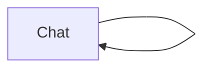
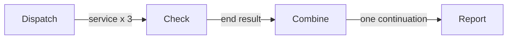
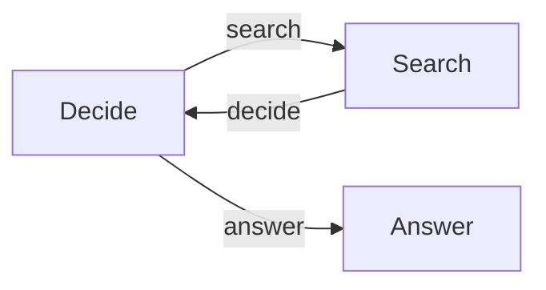

# TypeScript Examples

The TypeScript projects use the same Sley control and runtime model as the Python
examples. Their state and handler types are collected in `types.ts` so readers
can focus on graph code first.

| Project                                                                                               | Complexity | Primary lesson                                             |
| ----------------------------------------------------------------------------------------------------- | ---------: | ---------------------------------------------------------- |
| [Terminal Chat](https://github.com/jigmd/sley/tree/main/cookbook/typescript-chat)                     |        3.5 | A typed one-node self-loop and deliberate `end()`          |
| [Search Agent](https://github.com/jigmd/sley/tree/main/cookbook/typescript-agent)                     |         11 | Typed state, named routes, a search loop, and final answer |
| [Concurrent Service Checks](https://github.com/jigmd/sley/tree/main/cookbook/typescript-batch)        |        5.5 | Fan-out, local concurrency, `end(value)`, and `combine`    |
| [Partial Batch Recovery](https://github.com/jigmd/sley/tree/main/cookbook/typescript-resilient-batch) |          6 | Flow recovery with settled branch terminals                |

Every project runs its real Sley graph in cookbook verification. External
providers are replaced by test-owned fakes where needed.

See the [complexity rubric](./points.md) for how cognitive load is estimated and
[Python Examples](./python.md) for the broader pattern catalog.

## Project Details

The full lessons below are generated from each project's README so the catalog
stays useful without duplicating hand-maintained prose.

<!-- generated-project-details:start -->

### Terminal Chat ([typescript-chat](https://github.com/jigmd/sley/tree/main/cookbook/typescript-chat))

**Complexity:** 3.5

<details>
<summary>Read the full lesson</summary>

A one-node terminal chat that remembers the conversation and repeats until the
user enters `exit`.



The node has an unlabelled link to itself. A normal successful return follows
that link and starts the next turn. `context.end()` bypasses the link and
finishes the branch, so the `exit` command closes the chat.

Conversation history stays in `context.state` and its small static model lives
in `types.ts`.

## Run

```bash
cp .env.example .env
npm install
npm run chat
```

</details>

### Concurrent Service Checks ([typescript-batch](https://github.com/jigmd/sley/tree/main/cookbook/typescript-batch))

**Complexity:** 5.5

<details>
<summary>Read the full lesson</summary>

This example checks three services concurrently and reports one combined
summary.



The dispatcher calls `emit("check", service)` once per service. Each check reads
that service from `context.input` and calls `end(result)`, finishing only its
branch and publishing one output.

The Flow permits three checks to run at once. After all of them settle,
`combine` reads `result.outputs`, stores a summary in shared state, and emits one
unlabelled continuation so the report node runs exactly once.

## Run

```bash
npm install
npm start
```

The checks finish in latency order rather than declaration order. This makes
their concurrent execution visible without depending on an external service.

</details>

### Recovering a Partially Completed Batch ([typescript-resilient-batch](https://github.com/jigmd/sley/tree/main/cookbook/typescript-resilient-batch))

**Complexity:** 6

<details>
<summary>Read the full lesson</summary>

This example imports three records in order. The first succeeds, the second has
an invalid amount, and the third is never started after the Flow fails.

The worker publishes each successful import with `end(value)`. When the next
worker throws, the Flow's `recover` callback receives a `ScopeFailure` whose
`terminals` contain the already-completed import. Recovery keeps that result and
calls `end(summary)`, explicitly replacing the failure with one successful batch
terminal.

The example uses `start(...).result()` instead of the everyday `run()` shortcut
so the final `Completed` or `Failed` status and terminals remain visible.

```text
record 1 -> end(imported record)
record 2 -> failure
record 3 -> not admitted
                 |
                 v
              recover -> end(partial summary)
```

## Run

```bash
npm install
npm start
```

Removing the recovery control call would leave the failure unhandled and produce
a `Failed` result instead.

</details>

### Search Agent ([typescript-agent](https://github.com/jigmd/sley/tree/main/cookbook/typescript-agent))

**Complexity:** 11

<details>
<summary>Read the full lesson</summary>

An agent that decides whether it needs web research before answering a
question.



`context.emit(action)` selects a named link. The search node loops back to the
decision node, while the answer node emits nothing and therefore exits the Flow
normally.

Long-lived research and the final answer stay in `context.state`. This example
keeps its small static data model in `types.ts`, separate from the workflow.

## Decision Contract

The decision prompt shows the model the exact YAML shape for both allowed
actions. `parseDecision` still treats the response as untrusted data: it checks
the action, reason, and required search query before `context.emit(action)` can
change graph control. The TypeScript type documents the contract; the runtime
check enforces it.

This explicit prompt-and-validate approach is deliberately used instead of a
provider-specific structured-output helper, so the example works with both
OpenAI and OpenRouter without another schema library.

## Run

```bash
cp .env.example .env
npm install
npm run agent -- "What is the latest Deepseek LLM model?"
```

</details>

<!-- generated-project-details:end -->
