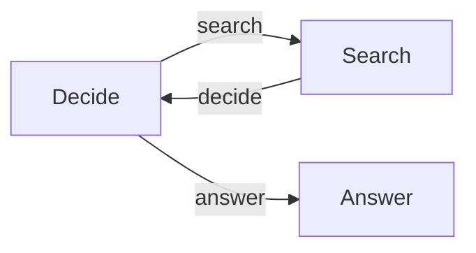

# Agent

An agent is usually a decision loop around tools.



```python
@node
def decide(context):
    decision = parse_decision(call_model(context.state))
    context.emit(decision.action)


decide.link(search, "search")
decide.link(answer, "answer")
search.link(decide, "decide")
agent = Flow(decide, max_activations=30)
```

## Responsibilities

- The model or application chooses an action from the known action space.
- Caskada resolves that action only through declared links or Flow exits.
- Tool nodes perform effects and record useful facts in state.
- The decision node runs again after a tool when more work may be needed.
- The answer leaf emits nothing and exits normally.

Validate model-produced actions before emitting. An unknown Caskada action is a
structured workflow failure, but a domain parser can provide a clearer error
before control reaches the runtime.

Use `max_activations` to bound the Flow loop and provider timeouts to bound
external calls.
Retries repeat a whole handler, so keep retryable generation separate from
state commits and irreversible effects.

See [python-agent](../../cookbook/python-agent/) and
[typescript-agent](../../cookbook/typescript-agent/).
