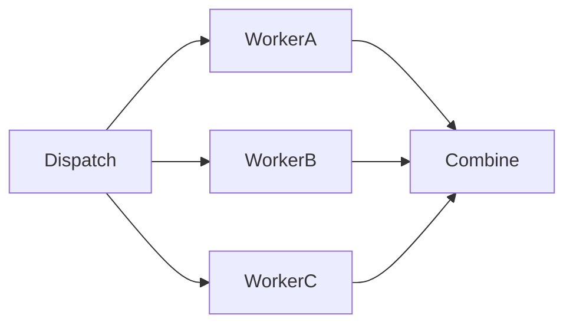

# Map Reduce

Map/reduce is Sley's fan-out plus structured-join shape.



## Map

The dispatcher emits one work item per branch. Workers read `context.input` and
publish results with `end(value)`.

```python
@node
def dispatch(context):
    for item in context.state["items"]:
        context.emit("work", item)


@node
def worker(context):
    context.end(transform(context.input))
```

## Reduce

The containing Flow owns synchronization, so its combiner reduces once:

```python
def reduce(context, result):
    context.state["total"] = sum(result.outputs)
```

Zero combiner emissions preserve the worker terminals. Emit when the reduced
value should continue to another node:

```python
def reduce(context, result):
    context.emit(input=sum(result.outputs))
```

That one emission replaces all worker terminals with one continuation.

Terminal order is settlement order, not source order under concurrency. Carry
an index in each branch value and sort in the combiner only when source order is
part of the application's result contract.

A generic map/reduce helper often hides the important boundary. Prefer a local
combiner unless reusable Map and Reduce nodes are the lesson, as in
[python-map-reduce](../../cookbook/python-map-reduce/).
