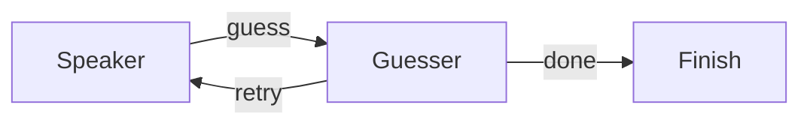

# Multi-Agent

Multi-agent systems are nested role workflows with explicit messages and
control paths. Caskada does not require an Agent base class.



Use branch input for the message handed from one role to the next. Use shared
state for durable game, task, or conversation facts that every role may read.

```python
@node
def speaker(context):
    hint = make_hint(context.state["target"])
    context.emit("guess", hint)


@node
def guesser(context):
    guess = make_guess(context.input)
    context.state["guess"] = guess
    context.emit("done" if guess == context.state["target"] else "retry")
```

Nest a Flow when one role owns an internal tool loop or supervision cycle. A
normal exit from the child resumes through the child Flow occurrence's parent
link. A hard `end()` skips that parent continuation, so reserve it for a result
that should remain terminal across boundaries.

Parallel roles share the run state and borrowed payload references. Prefer
immutable messages, disjoint state keys, or a combiner rather than unsynchronized
updates to the same value.

See [python-multi-agent](../../cookbook/python-multi-agent/) and
[python-supervisor](../../cookbook/python-supervisor/).
