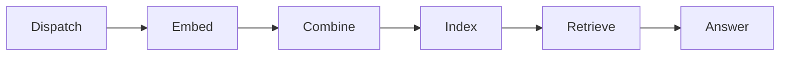

# Retrieval-Augmented Generation

A RAG application commonly has two logical phases:

1. Index documents.
2. Embed a question, retrieve relevant text, and generate an answer.

The durable index and final answer belong in shared state. Individual documents
are branch inputs when indexing uses fan-out.



## Indexing

```python
@node
def dispatch(context):
    for document in context.state["documents"]:
        context.emit("embed", document)


@node
def embed(context):
    context.end(embed_document(context.input))


def collect(context, result):
    context.emit(input=list(result.outputs))
```

`end(vector)` publishes one document result. The Flow's combiner runs once after
all documents settle and replaces those worker terminals with one list for the
index node.

Handle an empty document collection explicitly. A normal zero-emission handler
would synthesize an unlabelled continuation rather than represent zero work.

## Online Queries

Retrieval usually remains linear and shares the index by nested reference. If
indexing and querying are separate root runs, use the state returned by the
first run as the initial state for the second:

```python
state = await offline.run(initial_state)
state = await online.run(state)
```

One composed root Flow avoids an intermediate ownership boundary when both
phases are one workflow.

See [python-rag](../../cookbook/python-rag/).
