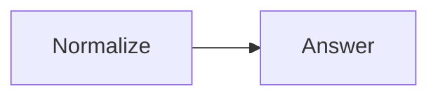

# Getting Started

This first Flow has two nodes. The first normalizes a question and the second
stores an answer.



## Python

```python
import asyncio

from sley import Context, Flow, node


@node
def normalize(context: Context) -> None:
    context.state["question"] = context.state["question"].strip()


@node
def answer(context: Context) -> None:
    context.state["answer"] = f"You asked: {context.state['question']}"


# A normal return follows the unlabelled link.
normalize.link(answer)
qa = Flow(normalize)


async def main() -> None:
    state = await qa.run({"question": "  Why?  "})
    print(state["answer"])


asyncio.run(main())
```

## TypeScript

```typescript
import { Flow, node } from 'sley'

interface State {
  question: string
  answer?: string
}

const normalize = node<State>((context) => {
  context.state.question = context.state.question.trim()
})

const answer = node<State>((context) => {
  context.state.answer = `You asked: ${context.state.question}`
})

// A normal return follows the unlabelled link.
normalize.link(answer)
const qa = new Flow(normalize)

const state = await qa.run({ question: '  Why?  ' })
console.log(state.answer)
```

## What Happened

1. `node(...)` created two graph occurrences from ordinary functions.
2. `normalize.link(answer)` added a directional unlabelled link.
3. `normalize` emitted nothing, so successful normal-handler completion created
   one implicit unlabelled continuation.
4. Both handlers accessed one run-owned `context.state` map.
5. `answer` had no link, so its normal continuation exited the Flow.
6. `run()` returned the final state. The original top-level input mapping was
   not mutated.

There was no need for `emit()`, `end()`, or `combine` in this linear workflow.
Those controls appear when the graph branches or needs a structured join.

Continue with the [Core Model](core_abstraction/index.md) or the
[Hello World cookbook](../cookbook/python-hello-world/).
