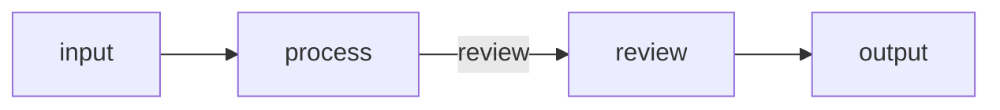

# Agentic Coding with Caskada

Use a short design document to keep a human and an implementation agent aligned.
The document should explain the workflow well enough to review before code is
written, without turning into a second implementation.

## Design Before Implementation

The human owns purpose, constraints, and acceptance. The implementation agent
can propose topology and code, but must surface ambiguous control and data
contracts before choosing them silently.

For a new workflow:

1. define examples and expected results;
2. sketch nodes, links, nested Flow boundaries, and loops;
3. identify external service calls;
4. assign each data item to state, branch input, or End output;
5. decide where fan-out joins and what the combiner produces;
6. define failure, retry, recovery, and local work bounds;
7. agree on observable success criteria;
8. implement the smallest end-to-end path first.

## Design Document Template

````markdown
# Design: <Project>

## Requirements

- Problem:
- Users:
- Success criteria:
- Constraints:
- Example inputs and expected outputs:

## Flow

- Entry:
- Nodes and responsibilities:
- Unlabelled and named links:
- Nested Flows and declared exits:
- Loops and bounds:


````

## Data

- Shared state keys:
- Branch input shapes:
- End output shapes:
- Runtime validation boundaries:

## Fan-Out and Combine

- What creates branches:
- Local concurrency:
- What ends each branch:
- What `combine` reads and emits:
- Empty-input behavior:

## Services

- Service function:
- Input and output:
- Timeout and rate limit:
- Fake used by tests:

## Failure Policy

- Retried failures and maximum attempts:
- Side effects that must be idempotent:
- Recovery behavior:
- Flow activation limits and provider timeouts:

## Verification

- Unit checks for domain logic:
- Flow scenarios:
- Failure and recovery scenarios:
- Commands that prove completion:

```

Delete sections that do not apply. Add a section only when it represents a real
decision the team must preserve.

## Describe Node Behavior Precisely

For each node, state:

- the one job it performs;
- state keys it reads and writes;
- input it expects and how it is validated;
- zero, named, or repeated emissions it may append;
- whether it can create an End output;
- fallible or irreversible operations it performs.

Do not describe v3 nodes as preparation, execution, and post-processing phases.
There is one handler. Ordering inside that handler matters, especially because a
retry repeats it from the beginning.

## Make Data Roles Explicit

Use `context.state` for facts shared across the run, `context.input` for the
current branch's work item, and `context.end(value)` for a completed branch value
that a Flow may combine.

Caskada does not validate application schemas or prove compatibility across
links. The design should name the node that validates each dynamic boundary.
Static types document local expectations but do not replace runtime parsing.

## Design Termination and Joining

Record why a leaf exits normally or creates a hard End:

- zero emissions take the unlabelled path or exit the current Flow;
- `emit("name")` selects a named link or declared exit;
- `end(value)` finishes one branch and bypasses links;
- a Flow combine callback runs once after that Flow's children settle;
- zero combine emissions preserve the child terminals;
- combine emissions replace those terminals with new continuations.

An empty fan-out loop also has zero emissions. Decide its behavior explicitly.

## Keep Service Utilities Ordinary

External integrations should be plain functions or small client objects with
clear inputs, outputs, timeouts, and fakes. A handler coordinates them; it should
not hide graph control inside a service wrapper.

Prefer native async APIs. If a blocking call is offloaded, document that runtime
control cannot kill the underlying thread and that the provider still needs its
own timeout.

## Implement in Reviewable Slices

Build one executable path before broadening the graph. After each slice:

1. run the real Flow with test-owned fakes;
2. inspect returned state;
3. exercise the intended routes and terminals;
4. inspect structured failure through `start()` where relevant;
5. update the design when the contract actually changes.

Do not add production hardening merely to make an instructional prototype look
complete. Conversely, do not claim completion while required behavior remains a
stub or while verification commands have not run.

## Completion Questions

Before calling the implementation complete, answer yes or no:

- Does every stated success criterion have a passing check?
- Does every graph link resolve intentionally?
- Are state, input, and End output roles consistent across connected nodes?
- Are empty input, retry, failure, and termination behaviors deliberate?
- Were all documented verification commands run successfully?
- Does the design document still describe the code that exists?
```
