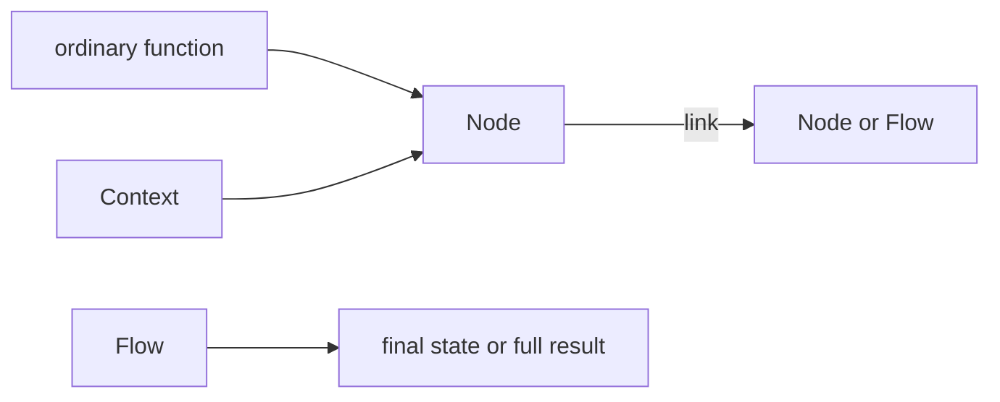

# Core model

This page gives you the whole Sley model before the following lessons build it
one part at a time. It assumes you have completed the [Quickstart](../quickstart.md).

## Four pieces



| Piece       | What it owns                                                        |
| ----------- | ------------------------------------------------------------------- |
| **Node**    | One sync or async function, plus optional retry and recovery policy |
| **Link**    | One allowed path from a Node or nested Flow to its next target      |
| **Context** | Shared state, this branch's input, and buffered control calls       |
| **Flow**    | An entry point and a scope that waits for all of its branches       |

Nodes and Flows are both graph elements, so either can be the target of a link.




```python
prepare.link(decide)
decide.link(publish, "publish")
decide.link(review, "review")
workflow = Flow(prepare)
```




```typescript
prepare.link(decide)
decide.link(publish, 'publish')
decide.link(review, 'review')
const workflow = new Flow(prepare)
```




The target comes first in `link(target, action?)`. Each action on one graph
element has at most one target, so a route is unambiguous.

## Data has three roles

| Data                 | Use it for                                            |
| -------------------- | ----------------------------------------------------- |
| `context.state`      | Facts shared by every branch for the life of one run  |
| `context.input`      | The message carried by this branch                    |
| `context.end(value)` | A completed branch value intended for a Flow boundary |

Sley validates its own graph and control protocol. Your application owns the
shape and validation of values carried through these channels.

## A node settles before Sley moves

A node function does not return an application result. It changes state and
records zero, one, or several control intents through its Context.

- No explicit control call means one implicit unlabelled continuation.
- `emit()` chooses a continuation; several emissions create several branches.
- `end()` creates a hard terminal for the current branch.

Control calls do not stop the host function. Sley commits the complete control
buffer only after the function returns normally, so a failed callback cannot
leak a partial fan-out.

## A Flow settles after its branches

A Flow completes only after every branch in its scope has exited, ended, or
failed. `run(initialState)` is the everyday API: it returns final shared state
or raises `RunError`. `start(initialState)` exposes the full completed or failed
result when terminal and failure details matter.

Next, [Links and routing](routing.md) turns the linear quickstart into an
explicit decision.
