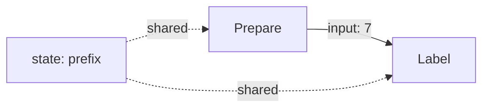

# State and input

Routing chooses where work goes. Data channels make the value's role explicit:
shared state stores run-wide facts, while input carries a message along one
branch.






```python
import asyncio

from sley import Flow, node


@node
def prepare(context):
    context.emit("label", 7)


@node
def label(context):
    context.state["label"] = f"{context.state['prefix']}-{context.input}"


prepare.link(label, "label")
labels = Flow(prepare)


async def main():
    initial = {"prefix": "ticket"}
    state = await labels.run(initial)

    print(state["label"])
    print("label" in initial)


asyncio.run(main())
```




```typescript
import { Flow, node } from 'sley'

interface State {
  prefix: string
  label?: string
}

const prepare = node<State>((context) => {
  context.emit('label', 7)
})

const label = node<State, number>((context) => {
  context.state.label = `${context.state.prefix}-${context.input}`
})

prepare.link(label, 'label')
const labels = new Flow(prepare)

const initial: State = { prefix: 'ticket' }
const state = await labels.run(initial)

console.log(state.label)
console.log('label' in initial)
```







```text
ticket-7
False
```




```text
ticket-7
false
```




## Shared state belongs to the run

Sley shallow-copies the initial top-level mapping once. Every branch and nested
Flow in that run shares the copied state, and `run()` returns it. That is why the
returned state contains `label` while the caller's top-level `initial` value
does not.

Nested objects are not copied. A list, object, client, or index stored inside
the initial state remains the same reference. Concurrent branches therefore
need the same coordination that ordinary concurrent code needs.

## Input belongs to one branch

`emit("label", 7)` carries `7` to the next activation as `context.input`.
Omitting a new input forwards the current input unchanged. Sley preserves the
value; it does not clone, freeze, or validate it.

Use state for facts that unrelated later steps need. Use input for the specific
item one branch is processing. Use `end(value)` when a completed branch should
publish a value to a Flow combiner; the next lesson shows that third role.


Types describe one handler's expectation, but Sley does not prove that linked
nodes agree or validate dynamic data. Python retains normal `KeyError` behavior
for a missing key; TypeScript retains normal `undefined` behavior. Validate
untrusted values before state changes or external effects.


Next, [Fan-out, End, and combine](fan-out-and-combine.md) sends several inputs
through independent branches and joins their completed values once.
