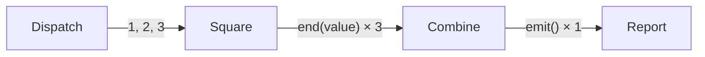

# Fan-out, End, and combine

Fan-out and joining are one causal sequence in Sley:

1. a dispatcher emits several branch inputs;
2. each worker ends with one completed value;
3. the owning Flow waits for every branch;
4. its combiner runs once with the completed outputs.

This example squares three numbers, combines their results, then continues to
one report node.






```python
import asyncio

from sley import Flow, node


def dispatch(context):
    for number in context.state["numbers"]:
        context.emit("square", number)


def square(context):
    context.end(context.input**2)


def combine_squares(context, result):
    context.state["squares"] = list(result.outputs)
    context.state["total"] = sum(result.outputs)
    context.emit()


def report(context):
    context.state["report"] = (
        f"{context.state['squares']} total {context.state['total']}"
    )


dispatch_node = node(dispatch)
square_node = node(square)
report_node = node(report)

dispatch_node.link(square_node, "square")
batch = Flow(dispatch_node, combine=combine_squares)
batch.link(report_node)
squares = Flow(batch)


async def main():
    state = await squares.run({"numbers": [1, 2, 3]})
    print(state["report"])


asyncio.run(main())
```




```typescript
import { Flow, node } from '@jigging/sley'

import type { Context, ScopeResult } from '@jigging/sley'

interface State {
  numbers: number[]
  squares?: number[]
  total?: number
  report?: string
}

const dispatch = node<State>((context) => {
  for (const number of context.state.numbers) {
    context.emit('square', number)
  }
})

const square = node<State, number>((context) => {
  context.end(context.input ** 2)
})

const combineSquares = (context: Context<State>, result: ScopeResult) => {
  const squares = result.outputs.map((value) => value as number)
  context.state.squares = squares
  context.state.total = squares.reduce((total, value) => total + value, 0)
  context.emit()
}

const report = node<State>((context) => {
  context.state.report = `[${context.state.squares!.join(', ')}] total ${context.state.total}`
})

dispatch.link(square, 'square')
const batch = new Flow(dispatch, { combine: combineSquares })
batch.link(report)
const squares = new Flow(batch)

const state = await squares.run({ numbers: [1, 2, 3] })
console.log(state.report)
```




Both programs print:

```text
[1, 4, 9] total 14
```

## Emissions create the branches

The dispatcher records three emissions before it returns. Each emission starts
one activation of `square` with a different `context.input`. The buffer commits
atomically after a normal return; if the dispatcher failed, none of those
partial branches would escape the failed attempt.

## End publishes completed values

Each worker calls `end(value)`. That call ends only the current branch, bypasses
its links, and contributes one output-bearing End terminal to the owning Flow.
Sibling branches continue.

`end()` does not stop the Python or TypeScript function. Return normally when
later statements must not run. `end()` creates a terminal without an output;
`end(None)` or `end(undefined)` creates an explicit output whose value is nullish.

## Combine joins once

After all three workers settle, `combine_squares` runs once. `result.outputs`
is the settlement-ordered projection of values from output-bearing terminals.
It does not contain shared state, handler return values, or intermediate
emissions.

This Flow uses the default concurrency of one, so the example settles in source
order. With concurrent workers, outputs remain in settlement order, which may
differ from dispatch order.

The combiner's one `emit()` replaces the three worker terminals with one
continuation from the `batch` Flow element. Its unlabelled link leads to
`report`, so that node runs exactly once. If the combiner emitted nothing, the
original worker terminals would remain terminal instead.


A node handler that emits nothing gets one implicit unlabelled continuation.
An empty dispatch loop therefore does not mean zero branches. Handle a
meaningful empty case explicitly with `end()` and return.


Next, [Nested Flows](nested-flows.md) explains why `batch` can act like one
element in the outer graph and how actions cross that boundary.
