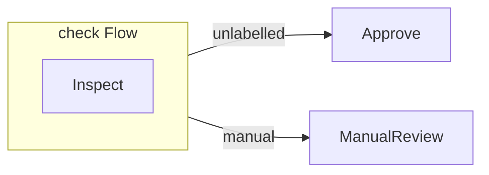

# Nested Flows

A Flow is also a graph element. Nest one when a group of nodes owns a meaningful
execution boundary, such as its own exits, combiner, recovery policy, concurrency
limit, or activation limit.

This child Flow classifies an amount. Its normal path leaves through the
unlabelled exit; large amounts leave through a declared `manual` exit.






```python
import asyncio

from sley import Flow, node


@node
def inspect(context):
    if context.state["amount"] > 100:
        context.emit("manual")


@node
def approve(context):
    context.state["decision"] = "approved"


@node
def manual_review(context):
    context.state["decision"] = "manual review"


check = Flow(inspect, name="check", exits=("manual",))
check.link(approve)
check.link(manual_review, "manual")
payments = Flow(check)


async def main():
    for amount in (45, 120):
        state = await payments.run({"amount": amount})
        print(f"{amount}: {state['decision']}")


asyncio.run(main())
```




```typescript
import { Flow, node } from '@jigging/sley'

interface State {
  amount: number
  decision?: string
}

const inspect = node<State>((context) => {
  if (context.state.amount > 100) {
    context.emit('manual')
  }
})

const approve = node<State>((context) => {
  context.state.decision = 'approved'
})

const manualReview = node<State>((context) => {
  context.state.decision = 'manual review'
})

const check = new Flow(inspect, { name: 'check', exits: ['manual'] })
check.link(approve)
check.link(manualReview, 'manual')
const payments = new Flow(check)

for (const amount of [45, 120]) {
  const state = await payments.run({ amount })
  console.log(`${amount}: ${state.decision}`)
}
```




The output is:

```text
45: approved
120: manual review
```

## Exits make the boundary explicit

For `45`, `inspect` returns without a control call. Its implicit unlabelled
continuation has no internal link, so it leaves `check` normally. The
unlabelled link on the `check` Flow element then leads to `approve`.

For `120`, `inspect` emits `manual`. It has no internal `manual` link, but the
owning Flow declares that action as an exit. The action crosses the boundary
and follows the `manual` link on the `check` Flow element.

A named action that has neither an internal link nor a declared exit fails.
This keeps a nested Flow from leaking misspelled or accidental actions into its
parent.

## End is different from an exit

An exit says, “this branch finished this Flow; let the parent route it.” A hard
End says, “this branch is terminal.” `context.end(value)` bypasses the child
Flow's links and remains terminal across enclosing boundaries unless a
combiner replaces it.

The previous batch used that distinction deliberately: worker Ends stayed
inside the batch until its combiner replaced them with one outward emission.

Do not create a nested Flow merely to group source files. Nest when the scope
owns behavior that readers can name.

Next, [Failures and results](failures-and-results.md) shows the simple final-state
API and the detailed result API side by side.
