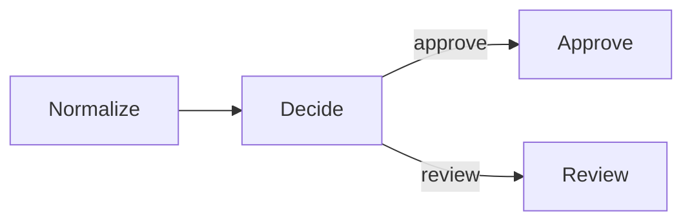

# Links and routing

Links describe allowed paths. A node follows its unlabelled link after an
ordinary return, or calls `emit(action)` to choose a named link.

This example sends each score to approval or manual review:






```python
import asyncio

from sley import Flow, node


@node
def normalize(context):
    context.state["score"] = max(0, min(100, context.state["score"]))


@node
def decide(context):
    action = "approve" if context.state["score"] >= 70 else "review"
    context.emit(action)


@node
def approve(context):
    context.state["decision"] = "approved"


@node
def review(context):
    context.state["decision"] = "manual review"


normalize.link(decide)
decide.link(approve, "approve")
decide.link(review, "review")
scores = Flow(normalize)


async def main():
    for score in (82, 64):
        state = await scores.run({"score": score})
        print(f"{score}: {state['decision']}")


asyncio.run(main())
```




```typescript
import { Flow, node } from 'sley'

interface State {
  score: number
  decision?: string
}

const normalize = node<State>((context) => {
  context.state.score = Math.max(0, Math.min(100, context.state.score))
})

const decide = node<State>((context) => {
  const action = context.state.score >= 70 ? 'approve' : 'review'
  context.emit(action)
})

const approve = node<State>((context) => {
  context.state.decision = 'approved'
})

const review = node<State>((context) => {
  context.state.decision = 'manual review'
})

normalize.link(decide)
decide.link(approve, 'approve')
decide.link(review, 'review')
const scores = new Flow(normalize)

for (const score of [82, 64]) {
  const state = await scores.run({ score })
  console.log(`${score}: ${state.decision}`)
}
```




The output is:

```text
82: approved
64: manual review
```

## Unlabelled paths are the normal path

`normalize` makes no control call. For a node handler, that successful return
acts like one `emit()` and follows the unlabelled link to `decide`.

If a node has no unlabelled link, the same continuation leaves its current Flow
normally. That is how both leaf nodes finish this workflow.

The string `"default"` has no special meaning. It is an ordinary named action,
distinct from the unlabelled path.

## Named paths fail fast

Sley resolves a named emission against the source element's matching link. A
named action with no link or declared Flow exit fails with an `unknown_action`
failure; it is never ignored and never guesses a target.

Links may point backward or to the same node, which creates a loop. Cyclic
graphs should set an explicit Flow activation limit; the
[Concurrency and cycles](../guides/concurrency-and-cycles.md) guide covers that
guard after the core lessons.

Next, [State and input](data.md) separates facts shared by the run from the
message carried along one path.
