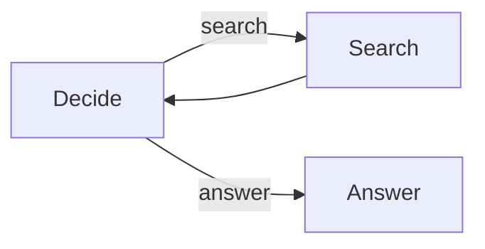

# Choose a Pattern

Start with an ordinary function. Add a Sley graph when the workflow has visible
decisions, repeated work, a structured join, or reusable nested scopes.

| Need                       | Smallest graph shape                         | Complete example                                                                                  |
| -------------------------- | -------------------------------------------- | ------------------------------------------------------------------------------------------------- |
| Fixed sequence             | Unlabelled links                             | [Article workflow](https://github.com/jigmd/sley/tree/main/cookbook/python-workflow)              |
| Decision or loop           | Named emissions and links                    | [Research agent](https://github.com/jigmd/sley/tree/main/cookbook/python-agent)                   |
| Process many items         | One emission per item                        | [Sequential batch](https://github.com/jigmd/sley/tree/main/cookbook/python-batch)                 |
| Process and aggregate      | Fan-out, `end(value)`, Flow `combine`        | [Concurrent service checks](https://github.com/jigmd/sley/tree/main/cookbook/typescript-batch)    |
| Reuse a subgraph           | A nested Flow as a graph element             | [Reusable batch Flow](https://github.com/jigmd/sley/tree/main/cookbook/python-batch-flow)         |
| Keep partial successes     | Flow recovery with settled terminals         | [Partial batch recovery](https://github.com/jigmd/sley/tree/main/cookbook/python-resilient-batch) |
| Map then reduce explicitly | Map and Reduce application nodes             | [Resume qualification](https://github.com/jigmd/sley/tree/main/cookbook/python-map-reduce)        |
| Validate model output      | Parse before state or control changes        | [Structured output](https://github.com/jigmd/sley/tree/main/cookbook/python-structured-output)    |
| Pause for a person         | Application event or a later run             | [Web human review](https://github.com/jigmd/sley/tree/main/cookbook/python-fastapi-hitl)          |
| Retrieve context           | Offline indexing plus an online Flow         | [RAG](https://github.com/jigmd/sley/tree/main/cookbook/python-rag)                                |
| Coordinate agents          | Separate Flows exchange application messages | [Multi-agent game](https://github.com/jigmd/sley/tree/main/cookbook/python-multi-agent)           |

## Compose mechanisms, not framework roles

Sley has no special Agent, RAG, Batch, or Human-in-the-loop class. Those names
describe application structures made from the same small runtime model:

The graph shows the behavior directly. Model calls, databases, queues, and user
interfaces remain ordinary dependencies inside or around handlers.

## Prefer Flow combine for synchronization

Use a Flow combiner when reduction must wait for every branch in that Flow.
Shared counters duplicate scheduler knowledge and become fragile under failure
or concurrency. Keep explicit Map and Reduce nodes only when those roles are the
lesson or a reusable application abstraction.

## Put human waiting at an application boundary

For a short in-process review, an async handler can await an application event
while the run remains alive. For a durable review, persist the pending
application state, return control to the web or UI layer, and start a later run
after the decision arrives. Sley does not persist or resume a suspended run.

Browse the [example projects](examples/README.md) by learning goal and
complexity.
