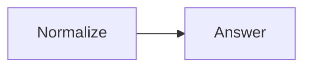

# Quickstart

In this quickstart, one node cleans a question and another produces a response.
The completed Flow returns the final shared state.



## Install Sley




Python 3.13 or newer is required.

```bash
python -m pip install sley
```




This example uses the type-stripping support in Node.js 24 or newer, so no
TypeScript runner is required.

```bash
npm install @jigging/sley
```




## Create one file




Create `quickstart.py`:

```python
import asyncio

from sley import Flow, node


@node
def normalize(context):
    context.state["question"] = context.state["question"].strip()


@node
def answer(context):
    context.state["answer"] = f"You asked: {context.state['question']}"


normalize.link(answer)
questions = Flow(normalize)


async def main():
    state = await questions.run({"question": "  Why?  "})
    print(state["answer"])


asyncio.run(main())
```

Run it:

```bash
python quickstart.py
```




Create `quickstart.mts`:

```typescript
import { Flow, node } from '@jigging/sley'

interface State {
  question: string
  answer?: string
}

const normalize = node<State>((context) => {
  context.state.question = context.state.question.trim()
})

const answer = node<State>((context) => {
  context.state.answer = `You asked: ${context.state.question}`
})

normalize.link(answer)
const questions = new Flow(normalize)

const state = await questions.run({ question: '  Why?  ' })
console.log(state.answer)
```

Run it:

```bash
node quickstart.mts
```




Both programs print:

```text
You asked: Why?
```

## What happened

1. `node` turned each ordinary function into a graph node.
2. `normalize.link(answer)` created an unlabelled path from the first node to
   the second.
3. `normalize` returned normally without an explicit control call, so Sley
   followed that path.
4. Both nodes read and changed the same run-owned `context.state`.
5. `answer` had no next link, so the branch left the Flow normally.
6. `run()` returned the final state.

That is the complete linear model. Continue with the
[Core model](learn/core-model.md) for the small set of concepts that also covers
branching and joining.
